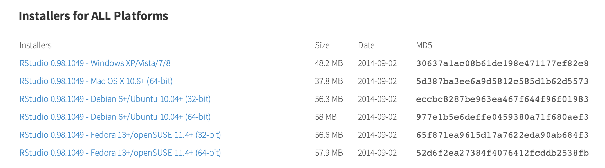
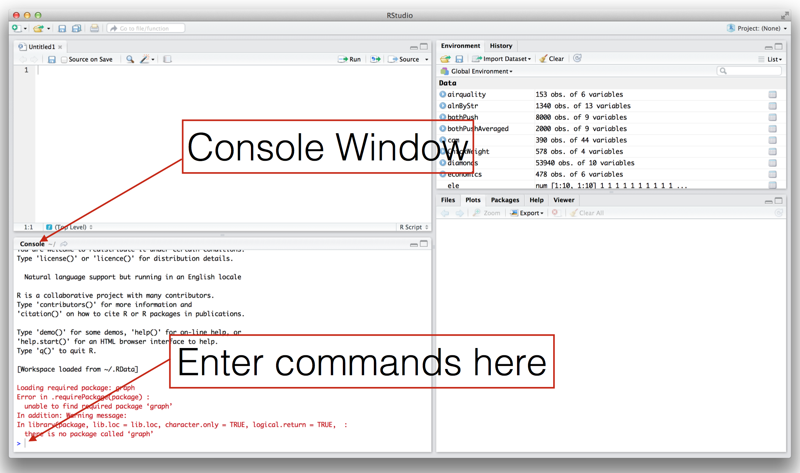

```{r setup, echo=FALSE, message=FALSE}
require(knitr)
#turn off mesages and warnings and make it so output isn't prefixed by anything, default is to put "##" in front of all output for some reason
opts_chunk$set(message=FALSE, warning=FALSE, comment = "")
```
**Confidence Builder #2: Word Clouds**

**Objective:**  To create a wordcloud like the one bellow

```{r ,fig.width=1, fig.height=1, echo=FALSE, fig.cap="Wordcloud Example"}
library(png)
library(grid)
img <- readPNG("../images/wordcloudExample.png")
 grid.raster(img)
```

**Instructions:**

Note:  The first 3 steps can be skipped if you've already completed Confidence builder #1.

1. Download and install R: http://cran.r-project.org  
  
2. Download and install RStudio: http://www.rstudio.com/products/rstudio/download/  
  
3. Open RStudio (you might only see 3 windows instead of 4)   
   
4. Now install two R packages useful for creating a wordcloud and choosing color palettes: Enter the bellow command or copy and paste it into the **console** window:  
```{r ,eval=FALSE}
install.packages(c("wordcloud", "RColorBrewer"))
```  
5. Load the two libraries that were just installed with the following command: Enter the bellow command or copy and paste it into the **console** window:  
```{r}
library(wordcloud)
```  
6.  Create your first word cloud with the following command: Enter the bellow command or copy and paste it into the **console** window:  
```{r, fig.width=6, fig.height=6, fig.cap='Example Wordcloud'}
wordcloud(c("This", "Is", "My", "First", "Word", "Cloud"), c(30,10,20,20,10,35), colors=brewer.pal(6, "Dark2"), ordered.colors=T, scale = c(5,0.5))
```

7. Learn a little more about programming in R with this pirate-themed tutorial: http://tryr.codeschool.com  

