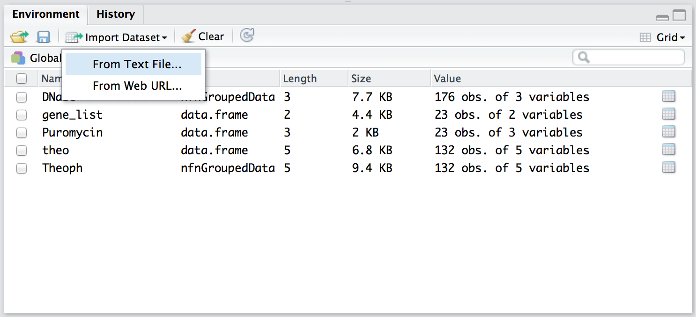
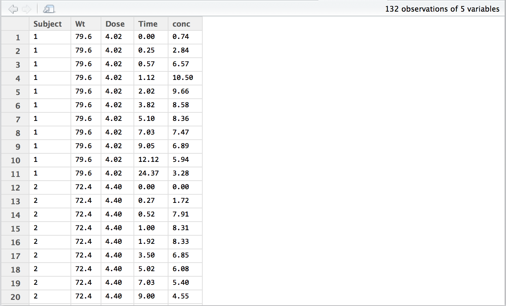
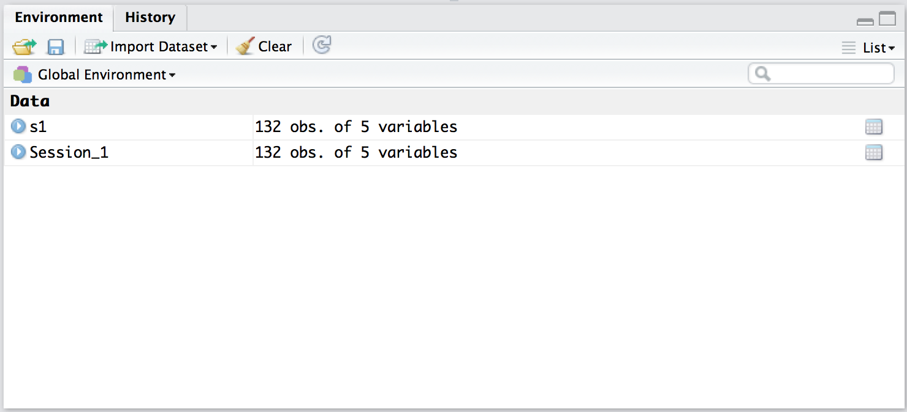

```{r setup, echo=FALSE, message=FALSE}
require(knitr)
#turn off mesages and warnings and make it so output isn't prefixed by anything,
#default is to put "##" in front of all output for some reason
#also set tidy to true so code is wrapped properly 
opts_chunk$set(message=FALSE, warning=FALSE, comment = "")
options(width = 60)
```
**Session Prep:** Download the dataset we will be working with for this session: [Session_1.txt](https://www.dropbox.com/s/yhz4f8j957n68yg/Session_1.txt?dl=0)

If you want you can download a pdf version of the lesson [here](https://www.dropbox.com/s/ugizqghe3pk4mkg/session_1.pdf?dl=0)

This dataset contains experimental data on the pharmacokinetics of theophylline, a drug used in the treatment of COPD and asthma. Here are the descriptions of each of the variables:  

**Subject** - a number identifying the subject on whom the observation was made. The ordering is by increasing maximum concentration of theophylline observed.  
**Wt** - weight of the subject (kg).  
**Dose** - dose of theophylline administered orally to the subject (mg/kg).  
**Time** - time since drug administration when the sample was drawn (hr).  
**conc** - theophylline concentration in the serum sample (mg/L).  

#Part 1: Reading in a dataset from a text file  

1. Use the "Import Dataset" feature of Rstudio: Import Dataset >> From Text File >> Browse to the Session_1.txt file  



RStudio will give you a preview of the dataset that looks a lot like an Excel table:  



If you look in the console window you'll see that two commands were executed. The first line stores the dataset as a data.frame named Session_1. The second line opens a preview of the data.frame. Note: The file path will be different depending on where the Session_1.txt file exists on your computer.  
```{r eval=FALSE}
Session_1 <- read.delim("/Desktop/Session_1.txt")
View(Session_1)
```  
2. Load the file again using the `read.delim()` function and a new function, `file.choose()`, and store it in a `data.frame` named s1.  
```{r eval=FALSE}
s1 <- read.delim(file.choose())
```  
You should now have two data.frames listed in your environment: s1 and Session_1  


Optional: Check to see if the two data.frames are identical:  
```{r echo=FALSE}
s1=read.delim("../dataSets/Session_1.txt")
Session_1=read.delim("../dataSets/Session_1.txt")
```  
```{r eval=TRUE}
identical(s1,Session_1)
```  
Optional: Use the `View()` function to display the s1 data.frame.

#Part 2: Exploring a dataset

There are five primary functions we will use to explore a dataset:  
```{r eval=FALSE}
summary()
head()
tail()
str()
View() #see exercise 1.1
```
1. The `summary()` function will display summary statistics on each variable in a `data.frame`. Summarize the s1 `data.frame` by entering the following in the console window:  
```{r eval=FALSE}
summary(s1)
```  
You should see this output in the console window:  
```{r eval=TRUE, echo=FALSE}
summary(s1)
```  
Tip: RStudio has a feature called tab-complete that can dramatically reduce the amount of typing you'll need to do. In the console window, if you type "sum" and then hit the tab key, you should see the `summary()` function listed as the second option. Use the down arrow to select summary and then hit enter. This works anytime you're typing, if you type "s" and hit tab, you should see the s1 `data.frame` at the top of the list. This is like autocomplete on your phone or when searching the web. You'll also notice that when you type the first opening parenthesis it adds the closing parenthesis automatically.  


2. The `head()` and `tail()` functions will display the first six lines and the last six lines of a `data.frame` in the console window, respectively. Display the first six lines of the s1 `data.frame`:  
```{r eval=FALSE}
head(s1)
```  
The output should look like this:  
```{r eval=TRUE, echo=FALSE}
head(s1)
```   
Note: The first column, which doesn't have a label, indicates the row numbers. Here, we see that rows 1-6 are displayed.  

Now display the last few lines of the s1 data.frame:  
```{r eval=FALSE}
tail(s1)
```  
You should see this as the output (note that rows 127-132 are displayed):  
```{r eval=TRUE, echo=FALSE}
tail(s1)
```  
You can also indicate the number of lines to display with an additional argument to both the head() and tail() functions. To display the first or last 10 lines, try:  
```{r eval=FALSE}
head(s1, n=10)
tail(s1, n=10)
```

3. Another way to quickly preview a data.frame is with the`str()` function (sometimes pronounce it "stir"). Apply this function to the s1 `data.frame`:  
```{r, eval=FALSE}
str(s1)
```  
The output should look like this:
```{r eval=TRUE, echo=FALSE}
str(s1)
```  
Tip: In the console window, you can use the up and down arrows to recall the previous commands you've entered. Use the up arrow to recall the command you used to display the first 10 lines of the s1 `data.frame`.  

4. You may have already noticed that R code is case sensitive and requires exact spelling matches. To get a sense of the common error messages that occur when you've misspelled something or used the wrong case try these commands:  

These commands will generate error messages indicating that a function can't be found:  
```{r eval=FALSE}
sumary(s1)
view(s1)
Read.Delim(file.choose())
```  
These commands will generate error messages indicating that an object can't be found:
```{r eval=FALSE}
summary(session_1)
View(S1)
head(s2)
```

*Optional*: Correct and re-enter the commands above.

#Part 3: Exploring a specific variable in a data.frame.

All of the functions you've learned in Part 2 can be applied to specific variable (e.g. a column) stored in a `data.frame`. The syntax for specifying a variable name is `data.frame$variable`.  

1. Using this syntax, we can display all of the values of the Time variable in the s1 data.frame:  
```{r, eval=FALSE}
s1$Time
```  
The output should look like this:
```{r eval=TRUE, echo=FALSE}
s1$Time
```  
Note: the number of lines will depend on the width of the console window but you should always see 132 values for this particular data.frame. We can check this by looking at the numbers in brackets at the beginning of each line. On the first line [1] indicates that 0.00 is the first value of the variable Time. On the last line [122] indicates that 0.00 is the 122th value of the Time variable. Counting across the row, we can see that 24.15 is the 132nd value.  

2. Now use the four functions you learned about in Part 2 (`summary()`, `head()`, `tail()`, `str()`) to display information about the Time variable in the s1 data.frame:  
```{r, eval=FALSE}
summary(s1$Time)
head(s1$Time)
head(s1$Time, n=10)
tail(s1$Time)
tail(s1$Time, n=10)
str(s1$Time)
```  
Here are a few additional functions that can be used to quickly summarize a variable. You may recognize some of them from Excel.  
```{r, eval=FALSE}
min()
max()
mean()
sum()
sd() #standard deviation
table() #frequency counts of each unique value
```  
3. Try out these functions on the Time variable in the s1 `data.frame` (i.e. `s1$Time`):  
```{r}
min(s1$Time)
```  
The output indicates that 0 is the minimum value:  
```{r}
max(s1$Time)
```
24.65 is the maximum value:  
```{r}
mean(s1$Time)
```
5.894621 is the mean or the average value:  

```{r}
sum(s1$Time)
```  
778.09 is the sum of the values of the Time variable  
```{r}
sd(s1$Time)
```
The standard deviation is 6.925952:  
```{r}
table(s1$Time)
```  
Yikes! You may have noticed that frequency counts are not always appropriate for variables with lots of unique values. Try using the `table()` function on the Subject variable in the s1 `data.frame`:  
```{r}
table(s1$Subject)
```  
Here, the output is much more appropriate and we see that there are 11 observations for each subject:

Advanced (*optional*): Earlier we used to the `indentical()` function to compare the s1 and Session_1 data.frames. Try to use this function to compare the conc variables in each of those data.frames. Are they identical?

4. You may have noticed that variable names are also case sensitive. Try these commands to see what kind of error messages you can expect when you haven't typed the variable name correctly:
```{r, eval=FALSE}
summary(s1$time)
head(s1$Conc)
min(s1$dose)
```
*Optional*: Try to correct and re-enter the above commands

Ok, one more error, which you may encounter when you're working with larger datasets. Enter the following code:
```{r, eval=FALSE}
vomit <- runif(1:100000)
vomit
```
A bunch of lines will spew across the console and you'll get something like this: 
```{r, eval=FALSE}
[9973] 8.458023e-01 6.285847e-02 2.523069e-01 6.230917e-01 5.983609e-01 8.318507e-01  
 [9979] 6.905970e-01 1.566991e-01 7.889734e-01 8.119727e-01 6.632301e-02 5.608480e-02  
 [9985] 4.320653e-01 7.313621e-01 5.808307e-01 4.450045e-01 4.845054e-02 2.959875e-02  
 [9991] 1.983839e-01 4.610772e-01 5.963980e-01 1.450190e-01 6.470672e-01 3.714696e-01  
 [9997] 5.144367e-01 3.211310e-01 5.469483e-01 6.439149e-01  
 [ reached getOption("max.print") -- omitted 90000 entries ]  
```  
The point here is that sometimes your dataset or variable can contain more information than R will display on screen. Don't be alarmed by this, it's an expected behavior!  

## Part 3 Questions {#part3_questions}
Now that you're familiar with some basic commands and error messages, try to apply what you've learned by answering the following questions (answers at the end).  

* What was the minimum value of the Dose variable in the s1 `data.frame`?  
* What is the maximum value of the Wt variable in the s1 `data.frame`?  
* What is the average value of the conc variable in the s1 `data.frame`?  
* How many unique values of the Subject variable are there s1 `data.frame`?  
* What is the 12th value of the Time variable in the s1 `data.frame`?  
See [Answers](#anspart3)

#Part 4: Plotting your first plot  {#part4}

Here we will introduce the `plot()` function, which can be used to generate a scatterplot of two variables on standard two-dimensional cartesian coordinate system (i.e. x-axis and y-axis).  

As a reminder, the dataset we loaded contains experimental data on the pharmacokinetics of theophylline, a drug used in the treatment of COPD and asthma. Here are the descriptions of each of the variables we now have stored in the s1 `data.frame`:

**Subject** - a number identifying the subject on whom the observation was made. The ordering is by increasing maximum concentration of theophylline observed.  
**Wt** - weight of the subject (kg).  
**Dose** - dose of theophylline administered orally to the subject (mg/kg).  
**Time** - time since drug administration when the sample was drawn (hr).  
**conc** - theophylline concentration in the serum sample (mg/L).  

Pharmacokinetics describes how a drug is metabolized and excreted by the body. Subjects were given a single dose and the concentration was measured in the serum over `max(s1$Time)` hours. Let's plot the concentration at each time point using the `plot()` function. The syntax is simple, `plot(x,y)`, where x is the variable to be plotted on the x-axis (often time) and y is the variable to plotted on the y-axis.  

1. Plot Time versus conc from the s1 data.frame:
```{r}
plot(s1$Time,s1$conc)
```  
2. Plot Subject versus conc from the s1 data.frame:  
```{r}
plot(s1$Subject, s1$conc)
```  

#Part 5: Putting it all together. {#part5}

In this final section you have the opportunity to practice all of the skills you've learned so far: from reading in a text file to exploring a dataset and finally making a graph.

Download this new dataset: [Mel.txt](https://www.dropbox.com/s/sx7711w301n649s/Mel.txt?dl=0)  

This dataset has data on 205 patients in Denmark with malignant melanoma. It contains the following columns:  

**time** - survival time in days, possibly censored.  
**status** - 1 died from melanoma, 2 alive, 3 dead from other causes.  
**sex** - 1 = male, 0 = female.  
**age** - age in years.  
**year** - of operation (i.e. surgery).  
**thickness** - tumour thickness in mm.  
**ulcer** - 1 = presence, 0 = absence.  

1. Read in the Mel.txt file.  
2. View the dataset  
3. Summarize all of the variables in the dataset  
4. What is the maximum tumor thickness?  
5. What are the maximum, minimum, and average survival times?  
6. In which year were the most operations (surgeries) performed?   
7. Plot the survival time by year  
8. Plot the tumor thickness by age  
9. Optional: What else can you discover about this dataset?  
[See Answers to part 5](#anspart5)  
Preview: Next week we'll show you additional methods for visualizing these two dataset which include the following box plot (sometimes called box and whisker plots if you're really old):  


Congratulations! 
You've just finished your first lesson in data visualization using R.

#Answers From Part 3 {#anspart3}

Part 3
5. Now that you're familiar with some basic commands and error messages, try to apply what you've learned by answering the following questions (answers at the end).  
What was the minimum value of the Dose variable in the s1 data.frame?  
```{r}
min(s1$Dose)
```  
What is the maximum value of the Wt variable in the s1 `data.frame`?  
```{r}
max(s1$Wt)
```  
What is the average value of the conc variable in the s1 `data.frame`?  
[Back to part 3 questions](#part3_questions)  
```{r}
mean(s1$conc)
```  
How many unique values of the Subject variable are there s1 `data.frame`?  

```{r}
table(s1$Subject)
```
What is the 12th value of the Time variable in the s1 `data.frame`? (there are many solutions, two shown below)
```{r}
head(s1$Time, n=12)
```   
[Back to part 3 questions](#part3_questions)  
```{r}
s1$Time
```  
[Back to part 3 questions](#part3_questions)

#Answers From Part 5 {#anspart5}

```{r, echo=FALSE}
melData <- read.delim("../dataSets/Mel.txt")
```

Read in and view data 

```{r, eval=FALSE}
melData <- read.delim(file.choose())
View(melData)
```

What is the maximum tumor thickness?  
```{r}
max(melData$thickness)
```  

What is the maximum survival time?  
```{r}
max(melData$time)
```  

What is the minimum survival time?  
```{r}
min(melData$time)
```  

[Back to part 5](#part5)  

What is the average survival time?  
```{r}
mean(melData$time)
```  

In which year were the most operations (surgeries) performed   
```{r}
table(melData$year)
```   

[Back to part 5](#part5)  
Plot the survival time by year  
```{r}
plot(melData$year, melData$time)
```   

Plot the tumor thickness by age  
```{r}
plot(melData$year, melData$thickness)
```  

[Back to part 5](#part5)

