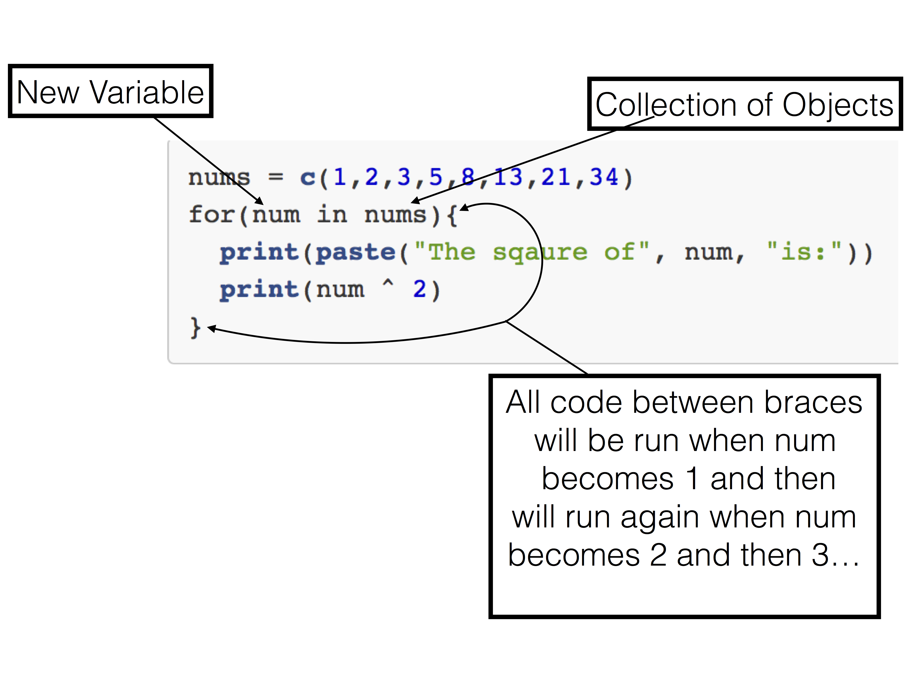

```{r setup, echo=FALSE, message=FALSE}
require(knitr)
#turn off mesages and warnings and make it so output isn't prefixed by anything,
#default is to put "##" in front of all output for some reason
#also set tidy to true so code is wrapped properly 
opts_chunk$set(message=FALSE, warning=FALSE, comment = "")
options(width = 60)
```

#For loop description
The initial set up of the for loop is made up of two parts. First you define a brand new variable that does not exist yet that will be become every element in the second part of the loop which is a collection of objects, normally a `vector` or a `list`. You then write code that you want to execute on each object in the `vector` in curly braces. All code that comes between the first open curly brace and the last closed corresponding curly brace will be run each time your newly defined variable becomes the next object in the supplied vector. 

```{r, fig.align='center', fig.cap="For Loop Example", echo=FALSE}

```

# Looping over a vector of numbers
```{r, echo=T, eval=T}
nums = c(1,2,3,5,8,13,21,34)
for(num in nums){
  print(paste("The sqaure of", num, "is:"))
  print(num ^ 2)
}
```
What is basically happening is here is the folowing 

The for loops will take a newly defined variable and set it each object in the supplied vector and then will re-run code every time the variable is set to the next object in the vecotr. 

```{r, echo=TRUE, eval = F}
nums = c(1,2,3,5,8,13,21,34)
num = nums[1]
print(paste("The sqaure of", num, "is:"))
print(num ^ 2)
#set num to the next thing, re-run the code
num = nums[2]
print(paste("The sqaure of", num, "is:"))
print(num ^ 2)
num = nums[3]
print(paste("The sqaure of", num, "is:"))
print(num ^ 2)
num = nums[4]
print(paste("The sqaure of", num, "is:"))
print(num ^ 2)
num = nums[5]
print(paste("The sqaure of", num, "is:"))
print(num ^ 2)
num = nums[6]
print(paste("The sqaure of", num, "is:"))
print(num ^ 2)
num = nums[7]
print(paste("The sqaure of", num, "is:"))
print(num ^ 2)
num = nums[8]
print(paste("The sqaure of", num, "is:"))
print(num ^ 2)
```
```{r, echo=F, eval=T}
nums = c(1,2,3,5,8,13,21,34)
for(num in nums){
  print(paste("The sqaure of", num, "is:"))
  print(num ^ 2)
}
```
# Looping over range of numbers
Instead of writing the folowing 

```{r, echo=T, eval=F}
print(1)
print(2)
print(3)
print(4)
print(5)
print(6)
print(7)
print(8)
print(9)
print(10)
```
```{r, echo=F, eval=T}
for(num in seq(1,10)){
  print(num)
}
```

You can write instead

```{r, echo=T, eval=T}
for(num in seq(1,10)){
  print(num)
}
```

#Looping over a vector of characters
```{r}
names = c("Nick", "Arjan", "Mike", "Henry", "Jake", "Amit")
for(name in names){
  print(name)
}
```


