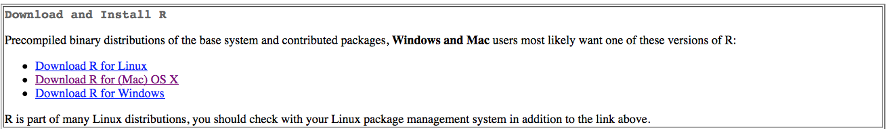
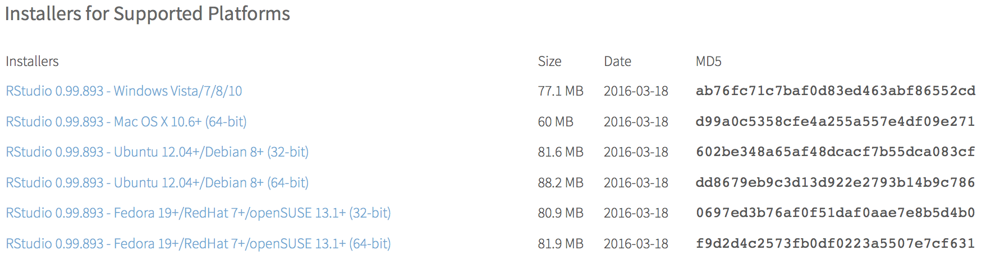

```{r setup, echo=FALSE, message=FALSE}
require(knitr)
#turn off mesages and warnings and make it so output isn't prefixed by anything, default is to put "##" in front of all output for some reason
opts_chunk$set(message=FALSE, warning=FALSE, comment = "")
```

#Installing R and RStudio
1. Download and install R: http://cran.r-project.org  
  
2. Download and install RStudio: http://www.rstudio.com/products/rstudio/download/  
  
3. Open RStudio (you might only see 3 windows instead of 4)   
   

#Small tutorial on basics of R
Next you should complete this short introduction of the very basics of R.  It should only take about 15-20 minutes to complete but is a very helpful introduction to R. Site here, [tryr.codeschool](http://tryr.codeschool.com/)

#Installing R Packages being used in Course
Once you are comfortable with entering commands into R, enter the following commands into the console window to install the R packages that we will be going over in the course.  

##For reading data in
```{r, eval = F}
#For reading data in
install.packages(c("readr","readxl", "haven"))
```

##For organizing Data
```{r, eval = F}
#For organizing Data
install.packages(c("dplyr", "tidyr", "reshape2"))
```

##For plotting
```{r, eval = F}
#For plotting
install.packages(c("ggplot2", "RColorBrewer"))
```

##For Downloading more packages not managed by R in install.packages()
```{r, eval = F}
#For Downloading more packages not managed by R in install.packages()
install.packages(c("devtools"))
```

##Addition commands to ggplot2
```{r, eval = F}
#Addition commands to ggplot2
devtools::install_github("kassambara/easyGgplot2")
```

##Interactive Plots
```{r, eval = F}
#Interactive Plots
install.packages(c("networkD3", "metricsgraphics", "shiny"))
devtools::install_github("rstudio/d3heatmap")
```

