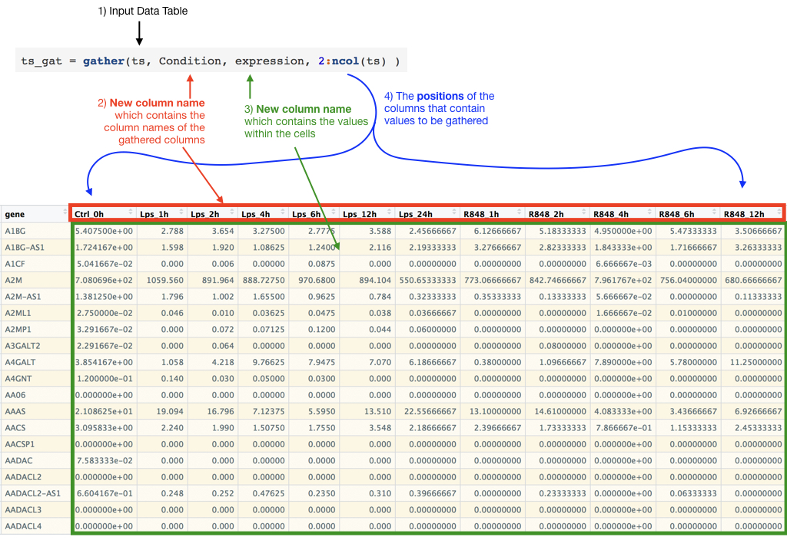
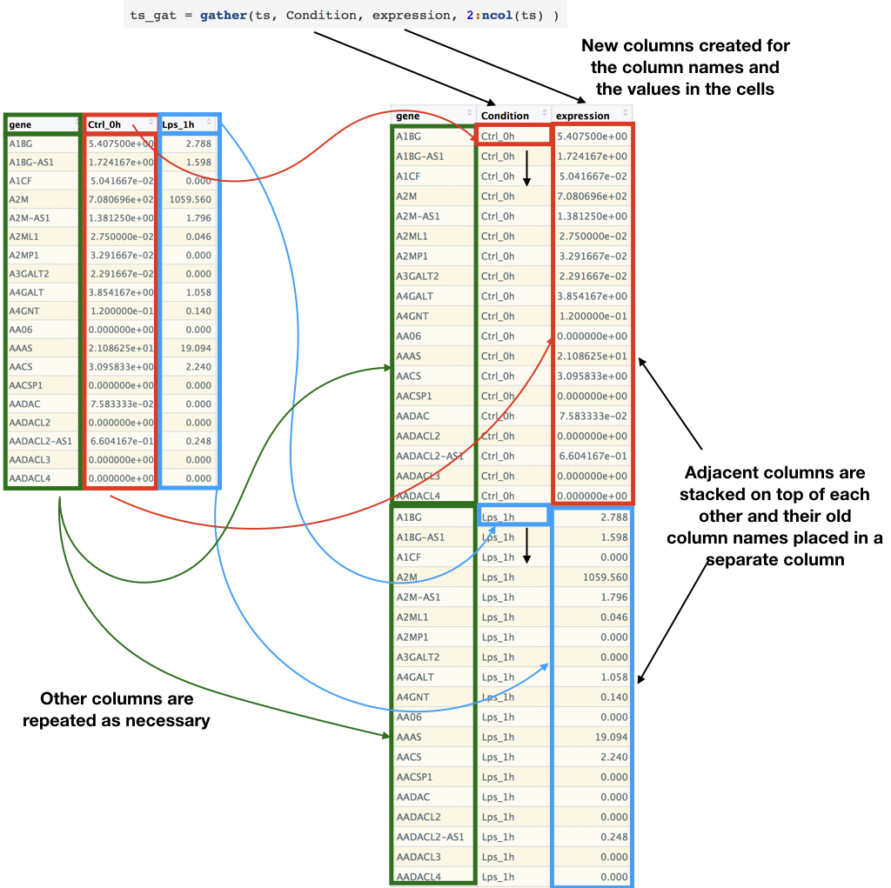
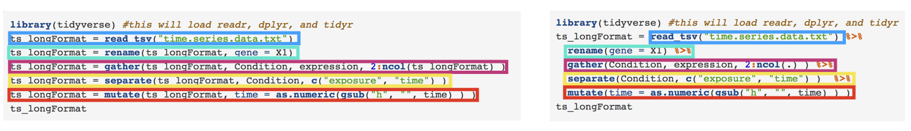

<!--Include script for hiding output chunks-->
<script>
$(document).ready(function() {
	console.log("hello")
  // Select all <pre> tags that do not have class 'r'
  $output = $(".toggleOutput");
  console.log($output)
  // Add the show/hide-button to each output chunk
  $output.prepend("<button style=\"float:right\" class=\"btn btn-primary showopt\">Show Output</button><br/>");
  // Select the <pre> tags, then choose their <code> child tags and toggle visibility 
  $output.children("code").css({display: "none"});
  
  // When the show/hide-button is clicked, toggle the current state and
  // change the button text
  $(".showopt").click(function() {
    $btn = $(this);
    $chunk = $(this).parent().children("code");
    if($btn.html() === "Show Output") {
      $btn.html("Hide Output");
    } else {
      $btn.html("Show Output");
    }
    $btn.toggleClass("btn-info btn-primary");
    $chunk.slideToggle("fast", "swing");
  });
});

</script>


```{r setup, echo=FALSE, message=FALSE}
require(knitr)
#turn off mesages and warnings and make it so output isn't prefixed by anything,
#default is to put "##" in front of all output for some reason
#also set tidy to true so code is wrapped properly 
opts_chunk$set(message=FALSE, warning=FALSE, comment = "")
options(width = 60)

knitr::knit_hooks$set(output = function(x, options) {
  return(paste0(
    "```{",
    ifelse(is.null(options$class),
      "", 
      paste0(" .", gsub(" ", " .", options$class))
    ),
    "}\n",
    x,
    "\n```"
  ))
})
```

# More Complex Data containers
The majority of the time you need to store more than just one value and therefore you will need containers that can hold multiple values at once, R comes equipped with several containers already

## matrix
R's matrix is very similar to the vector where all things have to be the same type but contains values in rows and columns.
```{r}
mat = matrix(c(1,2,3,4,5,6,7,8,9,10,11,12))

print(mat)

mat2 = matrix(c(1,2,3,4,5,6,7,8,9,10,11,12), ncol = 2)

print(mat2)

mat3 = matrix(c(1,2,3,4,5,6,7,8,9,10,11,12), ncol = 2, byrow = TRUE)

print(mat3)
print(class(mat3))
```
See `help(matrix)` for more info on how to use matrix.

## data.frame
The data.frame is a very commonly used object in R. It is similar to an spreadsheet/table data structure you in something like Excel with rows and columns, both of which can have names. The data.frame is different from the matrix because each column can have a different type, though all the elements in a column have to be the same type. You will rarely have to create a data.frame by hand and the majority of the time you read in a data.frame by using functions that read them in, but below are some examples of how you can create a data.frame by hand.    
```{r}
dat = data.frame(names = c("Nick", "Jake", "Mercedeh", "Jack", "Michael"), duration = c(7, 3, 3, 2, 7), program = c("MD/PhD", "PhD", "PhD", "PhD", "MD/PhD"))
print(dat)
```
A useful function for looking at a data.frame is the `str()` function. It will tell you information about each column.
```{r}
dat = data.frame(names = c("Nick", "Jake", "Mercedeh", "Jack", "Michael"), duration = c(7, 3, 3, 2, 7), program = c("MD/PhD", "PhD", "PhD", "PhD", "MD/PhD"))
str(dat)
```
With the `str()` function you can see that the we have three columns with the 1st and 3rd column being factors and the 2nd column being a numeric column. You can also see that for the variables that are factors you can see that they also have their coded numerical values next to them.  This is important to note when you are dealing with typos, for instance if we had typed this instead.   
```{r}
dat = data.frame(names = c("Nick", "Jake", "Mercedeh", "Jack", "Michael"), duration = c(7, 3, 3, 2, 7), program = c("MD/PhD", "PhD", "PhD", "PhD", "MD/PHD"))
str(dat)
```
You can see that we now have three levels for program rather than the two since we typed in one of the MD/PhD levels incorrectly.  

You can also use the function called `View()` to see the data in a spreadsheet like Viewer within RStudio.  
```{r, eval=F}
dat = data.frame(names = c("Nick", "Jake", "Mercedeh", "Jack", "Michael"), duration = c(7, 3, 3, 2, 7), program = c("MD/PhD", "PhD", "PhD", "PhD", "MD/PhD"))
View(dat)
```


# Scripting
Like most scientific fields we are always concerned with reproducibility and to that in a programming language like R you accomplish reproducibility by putting all your code into what is called scripts. To create a new R script in RStudio you simply click the `+` sign in the upper left hand corner and click `R Script` or you can use the hotkey shortcut of `Cmd + shift + n`.  

# Generic Layout of a script 
To make your life easier and the life of anyone looking at your scripts easier you normally want to keep them fairly organized. A normal layout is to have all packages or other files you will be using. Next comes any code that deals with reading and tidying up data tables. Then comes the code that does actually analysis followed by any code that writes tables or creates figures.  

## Commenting
To make your code more readable by other people it's good practice to do what is called commenting of your code. To do this you use the `#` symbol, whenever R sees the symbol '#' it completely ignores everything that comes after it until the next line

```{r}
#this will be ignored
print("hello") # this will also be ignored
```

# Path
When someone refers to a `path` they are normally talking about the location of a file or folder on a filesystem. Depending on the operating system (Windows vs Unix based(Mac, Ubuntu, etc.)) this will be represented slightly differently, specifically the use of `"/"`(Unix) vs `"\"` (Windows).  Luckily R takes care of this subtlety for you and you can also use `"/"`. Another piece of terminology that is important is folders are also referred to as directories. The path is represented by naming the parent directories to a file and the path to file/folder can be relative to your current working directory (more on this below). Also giving only `"/"` is considered the very top of your filesystem or the "root" position. An easy way to show this is to use the function `list.files()` 

```{r}
print(list.files("/"))
```

Two other important pieces of information is the special way to refer to the current directory (`"."`) and the directory above the current directory (`".."`). Again lets use the list.files. 

```{r}
print(list.files(".",full.names = T))
```

```{r}
print(list.files("..",full.names = T))
print(getwd())
```
Another way to explore this idea is to use the `file.choose()` method, which actually just returns the path to whatever file you choose.

```{r, eval = FALSE}
print(file.choose())
```
```{r,engine='bash',echo=FALSE}
echo "[1] \"/Users/nick/ownCloud/documents/exp_design_and_data_analysis_bootcamp_2016/introToR/time.series.data.txt\""
```

# Setting/Getting Working Directory
When working within R you have a working directory, which is where things will be output and this affects how you specify a location's path because it will be relative to this working directory. To get the working directory you use the function `getwd()`.   
```{r}
getwd()
```
You can also set your working directory by using the function `setwd()` and giving it the path to a new directory. It might be useful to save your old working directory
```{r}
outWd = getwd()

setwd("/")
list.files(".")
print(getwd())

setwd(outWd)
list.files(".")
print(getwd())

```

## Installing/Loading Libraries
To install new libraries you can use the `install.packages()` function and give it the name of a library that [The Comprehensive R Archive Network](https://cran.r-project.org/)(CRAN) has stored in their repositories. Below are some of the libraries that I use the most in R. The [tidyverse](https://www.tidyverse.org/packages/) library is a collection of libraries that help to read in data, manipulate data, and plot data. 

```{r, eval=FALSE}
#For reading in data, organizing data, and plotting
install.packages(c("tidyverse"))
```

Once you have installed a library, you can load it's functions by using the `library()` function
```{r, eval=FALSE}
library(tidyverse)
```


# Part 1 Excercises 
Here are the links for the data files mentioned below.

<a href = "ExampleData.xlsx">ExampleData.xlsx</a>  
<a href = "Both.xlsx">Both.xlsx</a>  
<a download = "Temperatures.txt" href = "Temperatures.txt">Temperatures.txt</a>  
<a download = "Mel.csv" href = "Mel.csv">Mel.csv</a>  
<a download = "WorEpi.tab.txt" href = "WorEpi.tab.txt">WorEpi.tab.txt</a>  

1.  Create a folder on your computer to store some files we will be reading into R (do this without using R or if you want to challenge yourself, Google how to create a folder with R and try it out!).  

2.  Now download the following files, ExampleData.xlsx, Both.xlsx, Temperatures.txt, Mel.csv, WorEpi.tab.txt and put them in this folder (again do this without R or again challenge yourself and Google or use the `help` function to how to use the R function `download.file` to do this)

3.  Set your working directory to this folder and list the files in the folder

4.  Install the package `tidyverse` and load it in R.  

# Reading in Data
Data files can come in multiple formats but some of the most common types are plain text files that have each column delimited by either tabs `"\t"` or commas `","`. R can also read in files that are saved in the excel format by using the package `readxl` from `tidyverse`.  

## File Formats

### Plain Text Files
For reading in plain text files there is a great package called `readr` which is part of `tidyverse`     
```{r}
library(readr)
```

For reading in tab delimited files we have `read_tsv` (tsv = tab seperated values) and for comma delimited files we have `read_csv` (csv = comma separated values).  
Also a helpful function might be to use `file.choose()`  
Once a library is installed (vis **install.packages()**) you can just call its functions by using the package name followed by two : and the function name e.g. readr::read_tsv
```{r}
# 
worEpi = readr::read_tsv("WorEpi.tab.txt")
```

```{r}
library(readr) #this loads all the readr package functions so that they don't have to be called with the full name
worEpi = read_tsv("WorEpi.tab.txt") # just read_tsv and don't need readr::read_tsv once library(readr) has been called
str(worEpi)
```
or  
```{r, eval=FALSE}
worEpi = readr::read_tsv(file.choose())
str(worEpi)
worEpi
```  
Here is a [link](Mel.csv) to a comma separated file 
```{r}
melanoma = read_csv("Mel.csv")
str(melanoma)
head(melanoma)

```
or 
```{r, eval=FALSE}
melanoma = read_csv(file.choose())
str(melanoma)
```

### Reading from URL  
R can also read files directly from url links 
```{r}
melanoma = read_csv("http://bootstrappers.umassmed.edu/bootstrappers-courses/courses/rCourse/Session_1/Mel.csv")
str(melanoma)
head(melanoma)

```

Sometimes your data will have row names as well, which the functions of readr will read in and put as the first column without a name    

```{r}
temps = read_tsv("Temperatures.txt")
print(temps)
```

### Excel Sheets
For excel sheets we have the library `readxl`
```{r, eval=T}
library(readxl)
```

Here is a [link](Both.xlsx) to an excel sheet of both previous files as separate sheets
```{r}
library(readxl)
melanoma = read_excel("Both.xlsx")
head(melanoma)
```
By default it just reads the first sheet, you can tell it which sheet to read
```{r}
library(readxl)
worEpi = read_excel("Both.xlsx", sheet = 2)
head(worEpi)
```

You can also read in by giving the sheet's name, to get what the sheets names are you can use 
```{r}
library(readxl)
print(excel_sheets("Both.xlsx"))

worEpi = read_excel("Both.xlsx", sheet = "Sheet2")
head(worEpi)

melanoma = read_excel("Both.xlsx", sheet = "Mel")
head(melanoma)

```

### SAS and SPSS
For reading SAS and SPSS files we have the library `haven`.  I don't have any example datasets but the functions are below

```{r, eval=FALSE}
library(haven)
read_sas()
read_spss()
read_stata()
```


# Accesing elements in a vector
To access only certain elements in a vector you use the `[]` operator. You either give index/position of the elements you want or a logical vector of the same length where all the `TRUE` will be extracted. For the positions R used 1-based positions vs the more command [0-based](https://en.wikipedia.org/wiki/Zero-based_numbering) positions in various programming languages.   
```{r}
rNums = runif(20)
print(rNums)

#get the first element
print(rNums[1])

#get the first five elements
print(rNums[1:5])
```

You can get various different positions by giving a vector of positions
```{r}
#get the first 1st, 3rd, and 7th elements
print(rNums[c(1,3,7)])
```
You can also get multiple of the same position
```{r}
#get the first 1st element three times
print(rNums[c(1,1,1)])
```

You can get the elements using logic TRUE and FALSE
```{r}
#get the first 1st element three times
print(rNums> 0.5)
print(rNums[rNums > 0.5])
```

# Accessing elements in a matrix/data.frame
For matrixes and data.frames there are multiple ways to access certain subsets of the data, specifically rows and columns. To select rows and columns you use the `[]` operator again. You give rows and column number separated by a comma, leaving one blank means all of them  
```{r}
sheet1 = read_excel("ExampleData.xlsx", "Experiment_1")
#get the first row, all columns
sheet1[1,]

#get the 1st and 3rd rows, all columns
sheet1[c(1,3),]

#get the first column, all rows
sheet1[,1]

#get the 1-3 columns, all rows
sheet1[,1:3]

#get the 1-3 columns, 1-3 rows
sheet1[1:3,1:3]
```
Also the default is to assume you mean columns, so if you leave out the comma you will get those columns.  
```{r}
#get the 1-3 columns, all rows
sheet1[,1:3]

#same as above
sheet1[1:3]
```

Also helpful functions here are `ncol()` and `nrow()` which gives you the number of columns and rows for a data.frame/matrix. This can be used if you want certain columns starting at a position and then until the end of the dataframe. 

```{r}
#get the 2nd column to the end of the columns, all rows
sheet1[,2:ncol(sheet1)]

```


# Accesing elementins specific to data.frame
The above examples work for both matrix class and data.frame object but the next couple of examples only work for data.frames

## Accesing by column names using []
With data.frame objects you can give the column name in `[]` to get those columns, you can give one or several
```{r}
sheet1 = read_excel("ExampleData.xlsx", "Experiment_1")

sheet1["Patient"]

sheet1["Group1-Group1"]

sheet1[c("Patient", "Group1-Group1")]
```
##Accesing by column names using $
You can also access just one column by using the `$` symbol. 

```{r}
sheet1 = read_excel("ExampleData.xlsx", "Experiment_1")

sheet1$Patient

sheet1$'Group1-Group1'
```
The difference here is that the `$` is going to give just a vector where as `[]` will actually give you back a data.frame

```{r}
sheet1 = read_excel("ExampleData.xlsx", "Experiment_1")

patientMoney = sheet1$Patient
print(class(patientMoney))
patientBracket = sheet1["Patient"]
print(class(patientBracket))

```

# Adding columns to data.frame
You can also add a column with either the `[]` or the `$`. You can either give a single value that will be repeated for all the values of the column or you can give a vector of the same size. 

```{r}
sheet1 = read_excel("ExampleData.xlsx", "Experiment_1")

sheet1$Experiment = "Experiment_1"
print(sheet1)

sheet2 = read_excel("ExampleData.xlsx", "Experiment_2")
print(rep("Experiment_2", nrow(sheet2)))

sheet2["Experiment"] = rep("Experiment_2", nrow(sheet2))
print(sheet2)
```

# Part 2 Excercises 

<a download = "time.series.data.txt" href = "time.series.data.txt">time.series.data.txt</a>  


1.  Read in the [temperature dataset](Temperatures.txt) from above and find the max, min and mean temperature of your favorite month (columns) and favorite city (rows).  

2.  Create a folder and download the following file, time.series.data.txt, link above, which is a dataset of expression of genes in different cells in several exposure conditions. The rownames are the gene names, the file is tab (`\t`) separated file.     

3.  Read in time.series.data.txt

4.  Find the `max`, `min`, and `max` of the control column and one of the LPS exposure columns (the columns that start with LPS).  

5.  Find the `max`, `min`, and `max` of the several of your favorite genes (or just pick one) (hint: be careful of selection )


# Manipulating Data frames and matrices  
The **readr** package reads in data as what is called a **tibble** which is different from the default R data.frame. The **tibble** class was invented to be more efficient and more userfriendly than the data.frame but one major difference that trips up most people use to data.frame is that the **tibble** class doesn't allow rownames. While this doesn't make a big difference for most uses of the data.frame class there are instances when you need rownames for the matrix class. Below is how you would read in data that has rownmaes and then convert to a matrix and add the rownames. 

```{r eval = T}

ts = read_tsv("time.series.data.txt")
ts_mat = as.matrix(ts[, 2:ncol(ts)])
rownames(ts_mat) = ts$X1

```

## Converting to long vs wide formats 
### Tidyr
The `tidyr` package is about making your data.frames "tidy". Now what is meant by "tidy"? There are considered two ways to organize data tables. One is refered as "wide" format where each cell is a different observation and you have row and column names to explain what those observations are. The other foramt is called "long" format and this format is that every column is a different variable and each row is a different observation and this "long" format is the format that R is the best at for organizing. `tidyr` is all about switching between the two formats. 


#### gather
`gather()` will take a table in **wide** format and change it into **long** format. It takes four imporant arguments, 1) the data.frame to work on, 2) the name of a new column that contain the old column names, 3) the name of new column to contain the observation that were spread out in the column table, 4) the column indexs to "gather" together.

```{r}
library(tidyverse)
ts = read_tsv("time.series.data.txt")
#rename first column 
colnames(ts)[1] = "gene"
# or the rename function can also be used 
ts = read_tsv("time.series.data.txt")
ts = rename(ts, gene = X1)

ts

ts_gat = gather(ts, Condition, expression, 2:ncol(ts) )  
ts_gat

```  





#### spread  
The opposite of the **gather()** function is the **spread()** function which can be used to undo the **gather()**  
```{r}
ts_gat_sp = spread(ts_gat, Condition, expression)  
ts_gat_sp
```


#### separate 
**tidyr** also has functions for manipulating columns into multiple columns, the **separate** function  

```{r}
ts_gat = separate(ts_gat, Condition, c("exposure", "time") )  
ts_gat
```

#### unite  
The opposite of the **separate** function is the the **unite** function  
```{r}
ts_gat = unite(ts_gat, Condition,  exposure, time)  
ts_gat

```

```{r, echo = F}
ts_gat = separate(ts_gat, Condition, c("exposure", "time") )  
```

## Manipulating data in table  
The library **dplyr** can be used to manipulate the data within the table themselves while **tidyr** is more for reogranization  
### Mutating Columns types   
The **mutate** function can be used to either create new columns or change current columns. Here I also take advantage of the **gsub** function, which takes three arguments, 1) a pattern to replace, 2) what to replace the pattern with, 3) what to do the replacement on   
```{r}
library(dplyr)
ts_gat = mutate(ts_gat, time = as.numeric(gsub("h", "", time) ) )  
```

## Piping  
It is common practice with **tidyverse** functions to use something called **piping** which is using the results of function call and using that as input to the next function without saving that result in an intermediate varaible, this allows for much more efficient processing of the data as not as much memory is used by the computer. This **piping** is accomplished by the **%>%** operator, which a keyboard shortcut is hitting the command+shift+m keys together (control+shirt+m for windows or ubuntu). The pipe operator takes what is given to it and places that as the first argument in the next function (e.g. mean(x) == x %>% mean() ) Below is a diagram.  

```{r}
x = 1:10

mean(x)

x %>% mean()

```


```{r}
library(tidyverse) #this will load readr, dplyr, and tidyr
ts_longFormat = read_tsv("time.series.data.txt") 
ts_longFormat = rename(ts_longFormat, gene = X1)
ts_longFormat = gather(ts_longFormat, Condition, expression, 2:ncol(ts_longFormat) )
ts_longFormat = separate(ts_longFormat, Condition, c("exposure", "time") ) 
ts_longFormat = mutate(ts_longFormat, time = as.numeric(gsub("h", "", time) ) )
ts_longFormat

```

Is equalivant to 

```{r}
library(tidyverse) #this will load readr, dplyr, and tidyr
ts_longFormat = read_tsv("time.series.data.txt") %>% 
  rename(gene = X1) %>% 
  gather(Condition, expression, 2:ncol(.) ) %>% 
  separate(Condition, c("exposure", "time") )  %>% 
  mutate(time = as.numeric(gsub("h", "", time) ) )
ts_longFormat

```



Below shows the relationship between the above pipe commands and the commands executed one by one 

## Summarizing data  
**dplyr** also offers ways to quickly group and then summarize your data using the **group_by** and **summarize** functions.  

```{r}
ts_longFormat_exposure_summary = ts_longFormat %>% 
  group_by(exposure) %>% 
  summarise(mean_expression =   mean(expression), 
            median_expression = median(expression),
            max_expression =    max(expression), 
            min_expression =    min(expression), 
            sd_expression =     sd(expression))

ts_longFormat_exposure_summary

```

```{r}
ts_longFormat_exposure_time_summary = ts_longFormat %>% 
  group_by(exposure, time) %>% 
  summarise(mean_expression = mean(expression), 
            median_expression = median(expression),
            max_expression = max(expression), 
            min_expression = min(expression), 
            sd_expression = sd(expression))

ts_longFormat_exposure_time_summary

```


## Filtering data  

```{r}
ts_longFormat_crt = ts_longFormat %>% 
  filter(exposure == "Ctrl")
ts_longFormat_crt

```


# Part 3. Excercises

Download Average Temperatues USA  
<a download = "avg_temps_usa_wide.tab.txt" href = "avg_temps_usa_wide.tab.txt">Average Temperatues USA</a>  

1.  convert to **long** format by using gather() on the temperate columns    
2.  seperate columns so you have a column for year and month  
2.  create a table of mean temperatures for month, city, and months for each city (various group_by calls)  
1.  filter table to just one city or just one month  


