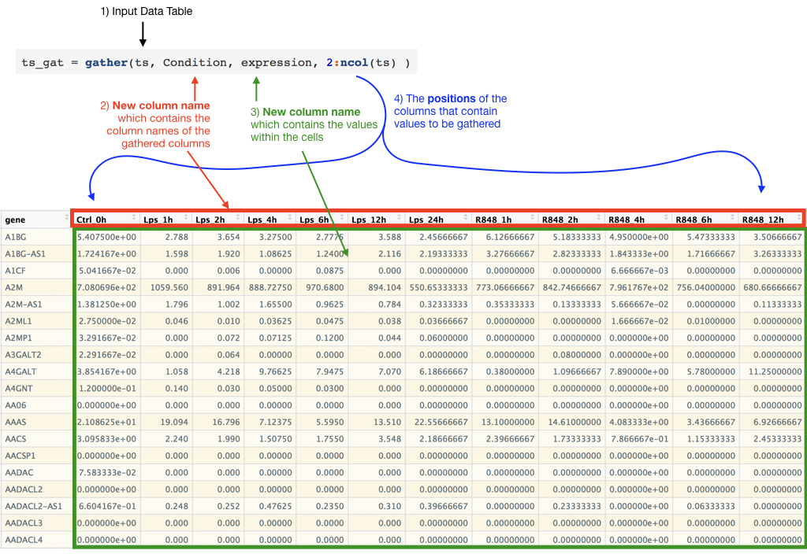
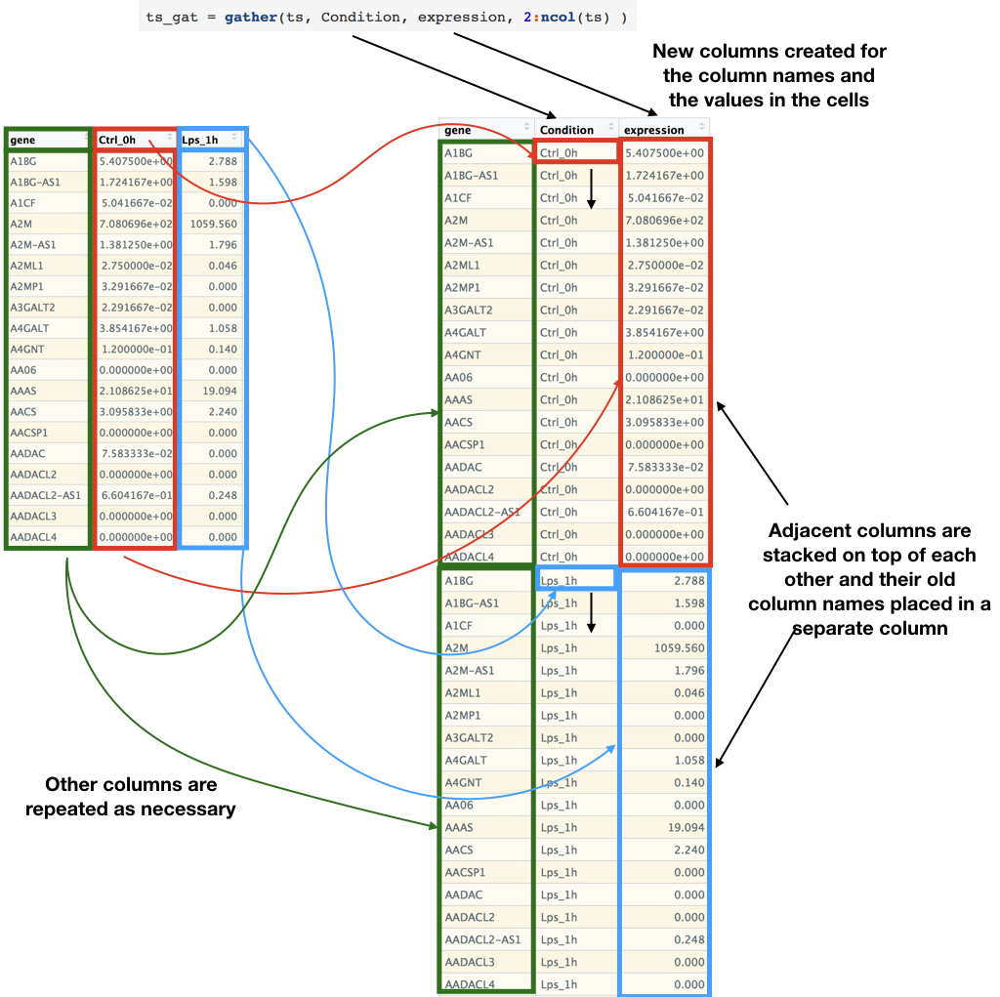

<!--Include script for hiding output chunks-->
<script>
$(document).ready(function() {
	console.log("hello")
  // Select all <pre> tags that do not have class 'r'
  $output = $(".toggleOutput");
  console.log($output)
  // Add the show/hide-button to each output chunk
  $output.prepend("<button style=\"float:right\" class=\"btn btn-primary showopt\">Show Output</button><br/>");
  // Select the <pre> tags, then choose their <code> child tags and toggle visibility 
  $output.children("code").css({display: "none"});
  
  // When the show/hide-button is clicked, toggle the current state and
  // change the button text
  $(".showopt").click(function() {
    $btn = $(this);
    $chunk = $(this).parent().children("code");
    if($btn.html() === "Show Output") {
      $btn.html("Hide Output");
    } else {
      $btn.html("Show Output");
    }
    $btn.toggleClass("btn-info btn-primary");
    $chunk.slideToggle("fast", "swing");
  });
});

</script>


```{r setup, echo=FALSE, message=FALSE}
require(knitr)
#turn off mesages and warnings and make it so output isn't prefixed by anything,
#default is to put "##" in front of all output for some reason
#also set tidy to true so code is wrapped properly 
opts_chunk$set(message=FALSE, warning=FALSE, comment = "")
options(width = 60)

knitr::knit_hooks$set(output = function(x, options) {
  return(paste0(
    "```{",
    ifelse(is.null(options$class),
      "", 
      paste0(" .", gsub(" ", " .", options$class))
    ),
    "}\n",
    x,
    "\n```"
  ))
})
```

# Manipulating Data frames and matrices  
The **readr** package reads in data as what is called a **tibble** which is different from the default R data.frame. The **tibble** class was invented to be more efficient and more user friendly than the data.frame but one major difference that trips up most people use to data.frame is that the **tibble** class doesn't allow rownames. While this doesn't make a big difference for most uses of the data.frame class there are instances when you need rownames for the matrix class. Below is how you would read in data that has rownames and then convert to a matrix and add the rownames. 

```{r eval = T}
library(tidyverse)

ts = read_tsv("time.series.data.txt")
ts_mat = as.matrix(ts[, 2:ncol(ts)])
rownames(ts_mat) = ts$X1

```

## Converting to long vs wide formats 
### Tidyr
The `tidyr` package is about making your data.frames "tidy". Now what is meant by "tidy"? There are considered two ways to organize data tables. One is referred as "wide" format where each cell is a different observation and you have row and column names to explain what those observations are. The other format is called "long" format and this format is that every column is a different variable and each row is a different observation and this "long" format is the format that R is the best at for organizing. `tidyr` is all about switching between the two formats. 


#### gather
`gather()` will take a table in **wide** format and change it into **long** format. It takes four important arguments, 1) the data.frame to work on, 2) the name of a new column that contain the old column names, 3) the name of new column to contain the observation that were spread out in the column table, 4) the column indexes to "gather" together.

```{r}
ts = read_tsv("time.series.data.txt")
#rename first column 
colnames(ts)[1] = "gene"
# or the rename function can also be used 
ts = read_tsv("time.series.data.txt")
ts = rename(ts, gene = X1)

ts

ts_gat = gather(ts, Condition, expression, 2:ncol(ts) )  
ts_gat

```  





#### spread  
The opposite of the **gather()** function is the **spread()** function which can be used to undo the **gather()**  
```{r}
ts_gat_sp = spread(ts_gat, Condition, expression)  
ts_gat_sp
```


#### separate 
**tidyr** also has functions for manipulating columns into multiple columns, the **separate** function  

```{r}
ts_gat = separate(ts_gat, Condition, c("exposure", "time") )  
ts_gat
```

#### unite  
The opposite of the **separate** function is the the **unite** function  
```{r}
ts_gat = unite(ts_gat, Condition,  exposure, time)  
ts_gat

```

```{r, echo = F}
ts_gat = separate(ts_gat, Condition, c("exposure", "time") )  
```

## Manipulating data in table  
The library **dplyr** can be used to manipulate the data within the table themselves while **tidyr** is more for reorganization  
### Mutating Columns types   
The **mutate** function can be used to either create new columns or change current columns. Here I also take advantage of the **gsub** function, which takes three arguments, 1) a pattern to replace, 2) what to replace the pattern with, 3) what to do the replacement on   
```{r}
library(dplyr)
ts_gat = mutate(ts_gat, time = as.numeric(gsub("h", "", time) ) )  
```

## Piping  
It is common practice with **tidyverse** functions to use something called **piping** which is using the results of function call and using that as input to the next function without saving that result in an intermediate variable, this allows for much more efficient processing of the data as not as much memory is used by the computer. This **piping** is accomplished by the **%>%** operator, which a keyboard shortcut is hitting the command+shift+m keys together (control+shirt+m for windows or ubuntu). The pipe operator takes what is given to it and places that as the first argument in the next function (e.g. mean(x) == x %>% mean() ) Below is a diagram.  

```{r}
x = 1:10

mean(x)

x %>% mean()

```


```{r}
library(tidyverse) #this will load readr, dplyr, and tidyr
ts_longFormat = read_tsv("time.series.data.txt") 
ts_longFormat = rename(ts_longFormat, gene = X1)
ts_longFormat = gather(ts_longFormat, Condition, expression, 2:ncol(ts_longFormat) )
ts_longFormat = separate(ts_longFormat, Condition, c("exposure", "time") ) 
ts_longFormat = mutate(ts_longFormat, time = as.numeric(gsub("h", "", time) ) )
ts_longFormat

```

Is equivalent to 

```{r}
library(tidyverse) #this will load readr, dplyr, and tidyr
ts_longFormat = read_tsv("time.series.data.txt") %>% 
  rename(gene = X1) %>% 
  gather(Condition, expression, 2:ncol(.) ) %>% 
  separate(Condition, c("exposure", "time") )  %>% 
  mutate(time = as.numeric(gsub("h", "", time) ) )
ts_longFormat

```


Below shows the relationship between the above pipe commands and the commands executed one by one 

## Summarizing data  
**dplyr** also offers ways to quickly group and then summarize your data using the **group_by** and **summarize** functions.  

```{r}
ts_longFormat_exposure_summary = ts_longFormat %>% 
  group_by(exposure) %>% 
  summarise(mean_expression =   mean(expression), 
            median_expression = median(expression),
            max_expression =    max(expression), 
            min_expression =    min(expression), 
            sd_expression =     sd(expression))

ts_longFormat_exposure_summary

```

```{r}
ts_longFormat_exposure_time_summary = ts_longFormat %>% 
  group_by(exposure, time) %>% 
  summarise(mean_expression = mean(expression), 
            median_expression = median(expression),
            max_expression = max(expression), 
            min_expression = min(expression), 
            sd_expression = sd(expression))

ts_longFormat_exposure_time_summary

```

## Filtering data  

```{r}
ts_longFormat_crt = ts_longFormat %>% 
  filter(exposure == "Ctrl")
ts_longFormat_crt

```


### NAs in values 
Taking means, mins, maxes, etc. can be affected if NA values are present 

```{r}
vals = c(10,3, 5, 9, 19, 23)

mean(vals)
min(vals)
max(vals)

vals = c(10,3, 5, 9, 19, 23, NA)

mean(vals)
min(vals)
max(vals)

```
You can handle this by setting `na.rm = T`
```{r}
vals = c(10,3, 5, 9, 19, 23, NA)

mean(vals, na.rm = T)
min(vals, na.rm = T)
max(vals, na.rm = T)

```

You can also just get rid of the NA values as well and if within in a data.frame you can use `filter()` you can do. 

```{r}
# use na.rm =T
ts_longFormat_exposure_time_summary = ts_longFormat %>% 
  group_by(exposure, time) %>% 
  summarise(mean_expression = mean(expression, na.rm =T), 
            median_expression = median(expression, na.rm =T),
            max_expression = max(expression, na.rm =T), 
            min_expression = min(expression, na.rm =T), 
            sd_expression = sd(expression, na.rm =T))


# use filter to keep only values of expression that aren't (!) NA (is.na)
ts_longFormat_exposure_time_summary = ts_longFormat %>% 
  filter(!is.na(expression)) %>% 
  group_by(exposure, time) %>% 
  summarise(mean_expression = mean(expression), 
            median_expression = median(expression),
            max_expression = max(expression), 
            min_expression = min(expression), 
            sd_expression = sd(expression))


```


dplyr offers a large array of available functions for manipulating data frames. Here is a list of resources for more options:  

1.  cheatsheet - https://raw.githubusercontent.com/rstudio/cheatsheets/master/data-transformation.pdf  
2.  a few basics tutorial - http://seananderson.ca/2014/09/13/dplyr-intro/  
3.  a webinar - https://www.rstudio.com/resources/webinars/data-wrangling-with-r-and-rstudio/  

# Part 1. Excercises

Download Average Temperatures USA  
<a download = "avg_temps_usa_wide.tab.txt" href = "avg_temps_usa_wide.tab.txt">Average Temperatures USA</a>  

1.  convert to **long** format by using gather() on the temperate columns    
2.  separate columns so you have a column for year and month  
2.  create a table of mean temperatures for month, city, and months for each city (various group_by calls)  
1.  filter table to just one city or just one month  


# Plotting  
Base R offers several basic plotting functions but in this course we will be focusing on using [ggplot2](http://ggplot2.tidyverse.org/) for plotting. A basic introduction can be found here, http://r4ds.had.co.nz/data-visualisation.html.  

## ggplot2 Basics 
A basic ggplot2 call

```{r, fig.width=8, fig.height=8}
# filter data to gene of interest 
ts_longFormat_SOD2 = ts_longFormat %>% 
  filter("SOD2" == gene)

ggplot(ts_longFormat_SOD2) + 
  geom_point(aes(x = time, y = expression) )
```

ggplot2 is based off of what is called Grammar of Graphics (hence gg plot), which is a book by Leland Wilkinson  https://www.amazon.com/Grammar-Graphics-Statistics-Computing/dp/0387245448. The philosophy of the book is that you should have a plotting system that allows you to simply describe what the plot should be based on and the computer will take care of it.

Of note, ggplot2 is the name of the library but the function call itself is `ggplot()` and not `ggplot2()`.  

ggplot2 works best by working on a long-format data frame, you then describe all layers on the plot, you add each layer with another geom_[TYPE] functions. There are many layers available, see http://ggplot2.tidyverse.org/reference/index.html#section-layer-geoms for a list and examples of each. 

```{r, fig.width=8, fig.height=8}
ggplot(ts_longFormat_SOD2) + 
  geom_point(aes(x = time, y = expression) ) + 
  geom_line(aes(x = time, y = expression) )
```

Below is a diagram of how a generic ggplot2 is structured. The aspects of the plot that you want to map to specific column in the data frame are given in the aes() call within the layer calls, (aes is short for aesthetic).  


If the mapping aesthetics are shared between layers you can give them in the top `ggplot()` call and they will be applied to each layer. 


```{r, fig.width=8, fig.height=8}
ggplot(ts_longFormat_SOD2, aes(x = time, y = expression)) + 
  geom_point() + 
  geom_line()
```

Now clearly this plot is not what we actually want to display, we are ignoring the exposure variable and this is causing the plot to look funny, so let's tell ggplot that we have a grouping variable, exposure.  

```{r, fig.width=8, fig.height=8}
ggplot(ts_longFormat_SOD2, aes(x = time, y = expression, group = exposure)) + 
  geom_point() + 
  geom_line()
```

Now let's add some coloring to make this plot a little more exciting.  
```{r, fig.width=8, fig.height=8}
ggplot(ts_longFormat_SOD2, aes(x = time, y = expression, group = exposure, color = exposure)) + 
  geom_point() + 
  geom_line()
```

Also when you add plotting aspects like coloring, ggplot2 assumes that this is also a grouping variable so you no longer have to supply grouping if you are giving a coloring variable.  
```{r, fig.width=8, fig.height=8}
plotSod2 = ggplot(ts_longFormat_SOD2, aes(x = time, y = expression, color = exposure)) + 
  geom_point() + 
  geom_line()
```

## Modifying colors 
Now the default color variables kind of leave a lot to be desired and we can set these colors to something else by using ggplot2's scale_color_[FUNC_NAME] to change the color plotting aspects. Here we are using the colors supplied by RColorBrewer, which you use by using `scale_color_brewer()`. 
```{r, fig.width=8, fig.height=8}
ggplot(ts_longFormat_SOD2, aes(x = time, y = expression, color = exposure)) + 
  geom_point() + 
  geom_line() + 
  scale_color_brewer(palette = "Dark2")
```
The color brewer palettes were developed by Martin Krzywinski on which he wrote a Nature paper on the subject, certain palettes were developed to be color blind safe, more information about his work can be found here http://mkweb.bcgsc.ca/colorblind/ and a website for helping choosing colors can be found here http://colorbrewer2.org/.  

For more information on how you can change the color other than `scale_color_brewer()` see here http://ggplot2.tidyverse.org/reference/index.html#section-scales. 

### Setting colors manually  
As most PIs are extremely picky about colors, there are also easy ways of setting specific colors for specific grouping using `scale_color_manual()`.  

```{r, fig.width=8, fig.height=8}
exposureColors = c("#005AC8", "#AA0A3C", "#0AB45A", "#14D2DC") 

ggplot(ts_longFormat_SOD2, aes(x = time, y = expression, color = exposure)) + 
  geom_point() + 
  geom_line() + 
  scale_color_manual(values = exposureColors)

```

The above will assign the colors in the order they appear in the data frame and you can make it sure it doesn't matter the order or if certain levels are missing (which could then mess up the ordering) you can name the color vector so that coloring is consistent. 

```{r, fig.width=8, fig.height=8}
exposureColors = c("#005AC8", "#AA0A3C", "#0AB45A", "#14D2DC", "#8214A0") 
names(exposureColors) = c("Ctrl", "R848", "Ifnb", "Lps", "other") 

ggplot(ts_longFormat_SOD2, aes(x = time, y = expression, color = exposure)) + 
  geom_point() + 
  geom_line() + 
  scale_color_manual(values = exposureColors)

```

If you don't name one of the layer it will not get a color, so be careful of case etc. 
```{r, fig.width=8, fig.height=8}
exposureColors = c("#005AC8", "#AA0A3C", "#0AB45A", "#14D2DC", "#8214A0") 
names(exposureColors) = c("Ctrl", "R848", "Ifnb", "LPS", "other") 

ggplot(ts_longFormat_SOD2, aes(x = time, y = expression, color = exposure)) + 
  geom_point() + 
  geom_line() + 
  scale_color_manual(values = exposureColors)

```


## Changing point shape and line types 

```{r, fig.width=8, fig.height=8}
ts_longFormat_SOD2_CD74 = ts_longFormat %>% 
  filter("SOD2" == gene | "CD74" == gene) # taking advantage of the or operator to do a check for either

# also you can also the %in% operator that R offers 
ts_longFormat_SOD2_CD74 = ts_longFormat %>% 
  filter(gene %in% c("SOD2", "CD74") )

# create a grouping variable to make plotting easier 
ts_longFormat_SOD2_CD74 = ts_longFormat_SOD2_CD74 %>% 
  mutate(grouping = paste0(gene, "-", exposure))

# using group = grouping to separate out the different genes and the exposure but still color by exposure 
ggplot(ts_longFormat_SOD2_CD74, aes(x = time, y = expression, color = exposure, group = grouping)) + 
  geom_point() + 
  geom_line() + 
  scale_color_brewer(palette = "Dark2")

```

But just coloring by exposure we can't tell which lines and points are from which genes so lets change the shape and line types so we distinguish 

```{r, fig.width=8, fig.height=8}
ggplot(ts_longFormat_SOD2_CD74, aes(x = time, y = expression, color = exposure, group = grouping)) + 
  geom_point(aes(shape = gene)) + 
  geom_line(aes(linetype = gene)) + 
  scale_color_brewer(palette = "Dark2")

```

## Changing plot aspect not dependent on input data  
If you want to change certain aspect about the plot that doesn't depend on mapping data from the input data frame you put these setting on the output of the `aes()` call.  


```{r, fig.width=8, fig.height=8}
# make the points larger, the value given to size is a relative number  
ggplot(ts_longFormat_SOD2_CD74, aes(x = time, y = expression, color = exposure, group = grouping)) + 
  geom_point(aes(shape = gene), size = 3) + 
  geom_line(aes(linetype = gene)) + 
  scale_color_brewer(palette = "Dark2")

```

You can also then change the linetypes and shapes with scale_ functions  

```{r, fig.width=8, fig.height=8}
geneLinetypes =c("dotted", "solid")
names(geneLinetypes) = c("CD74", "SOD2")
# make the points larger, the value given to size is a relative number  
ggplot(ts_longFormat_SOD2_CD74, aes(x = time, y = expression, color = exposure, group = grouping)) + 
  geom_point(aes(shape = gene), size = 3) + 
  geom_line(aes(linetype = gene)) + 
  scale_color_brewer(palette = "Dark2") + 
  scale_shape_manual(values = c(1, 3)) + 
  scale_linetype_manual(values = geneLinetypes)

```


## Switching to another layer type  
Say you decide to take your plot and switch to a different layer type, you can reuse a lot of what you have already done. For example lets switch from a dot/line plot to a bar plot by using `geom_bar()`. By default `geom_bar()` does plotting by counting up all values that fall into a group, but if you want a specific values instead you have to give `geom_bar()` `stat = "identity"` 

```{r, fig.width=8, fig.height=8}
ggplot(ts_longFormat_SOD2, aes(x = time, y = expression, color = exposure)) + 
  geom_bar(stat = "identity") +
  scale_color_brewer(palette = "Dark2")

```

Notice now that for `geom_bar()` color controls the border of the bars but if we want the bars themselves to be the given color we have to use `fill` instead. 
```{r, fig.width=8, fig.height=8}
ggplot(ts_longFormat_SOD2, aes(x = time, y = expression, fill = exposure)) + 
  geom_bar(stat = "identity") +
  scale_color_brewer(palette = "Dark2")
```

But we lost the colors we were trying to set and that's because we are using the `scale_color_brewer` but we are now using fill instead so we need the `scale_fill_brewer` function instead.  
```{r, fig.width=8, fig.height=8}
ggplot(ts_longFormat_SOD2, aes(x = time, y = expression, group = exposure, fill = exposure)) + 
  geom_bar(stat = "identity") +
  scale_fill_brewer(palette = "Dark2")
```

By default `geom_bar()` stacks all the bars belonging to the same x-axis grouping on top of each other but if we wanted them next to each other instead we give `geom_bar()` `position = "dodge"`. 
```{r, fig.width=8, fig.height=8}
ggplot(ts_longFormat_SOD2, aes(x = time, y = expression, group = exposure, fill = exposure)) + 
  geom_bar(stat = "identity", position = "dodge") +
  scale_fill_brewer(palette = "Dark2") 
```

We can make the bars stand out more by giving change the border color for all bars to be `black` 
```{r, fig.width=8, fig.height=8}
ggplot(ts_longFormat_SOD2, aes(x = time, y = expression, group = exposure, fill = exposure)) + 
  geom_bar(stat = "identity", position = "dodge", color = "black") +
  scale_fill_brewer(palette = "Dark2")
```

Now lets dress up the plot a little bit, we can do this by using ggplot2's `theme()` function which allows the tweaking of many different aspects of how the plot itself looks in general, let's change the legend position so it's on the bottom instead.  
```{r, fig.width=8, fig.height=8}
ggplot(ts_longFormat_SOD2, aes(x = time, y = expression, group = exposure, fill = exposure)) + 
  geom_bar(stat = "identity", position = "dodge", color = "black") +
  scale_fill_brewer(palette = "Dark2") + 
  theme(legend.position = "bottom") 
```

To see all the things that `theme()` can do use the help function  
```{r, fig.width=8, fig.height=8, eval = F}
help(theme)
```

We can also take advantage of preset themes supplied by ggplot2  
```{r, fig.width=8, fig.height=8}
ggplot(ts_longFormat_SOD2, aes(x = time, y = expression, group = exposure, fill = exposure)) + 
  geom_bar(stat = "identity", position = "dodge", color = "black") +
  scale_fill_brewer(palette = "Dark2") + 
  theme_bw() + 
  theme(legend.position = "bottom")
```

We can also change the title and labels of axis with `labs()` function and lets get rid of the panel around the plot (`panel.border = element_blank()`). Also center the title (`plot.title = element_text(hjust = 0.5)`).    
```{r, fig.width=8, fig.height=8}
ggplot(ts_longFormat_SOD2, aes(x = time, y = expression, group = exposure, fill = exposure)) + 
  geom_bar(stat = "identity", position = "dodge", color = "black") +
  scale_fill_brewer(palette = "Dark2") + 
  labs(title = "Expression of SOD2 gene", y = "Gene Expression", x = "Time (hrs)") + 
  theme_bw() + 
  theme(legend.position = "bottom", 
        panel.border = element_blank(), 
        plot.title = element_text(hjust = 0.5))

```


## Controlling plotting order using factors  
Let's say we didn't change the time column into a numeric column. Notice how the order isn't what we would want, this is because R will determine the order automatically by sorting the input values. 
```{r, fig.width=8, fig.height=8}

ts_longFormat_SOD2 = read_tsv("time.series.data.txt") %>% 
  rename(gene = X1) %>% 
  gather(Condition, expression, 2:ncol(.) ) %>% 
  separate(Condition, c("exposure", "time") ) %>% 
  filter("SOD2" == gene)

ggplot(ts_longFormat_SOD2, aes(x = time, y = expression, group = exposure, fill = exposure)) + 
  geom_bar(stat = "identity", position = "dodge", color = "black") +
  scale_fill_brewer(palette = "Dark2") + 
  labs(title = "Expression of SOD2 gene", y = "Gene Expression", x = "Time (hrs)") + 
  theme_bw() + 
  theme(legend.position = "bottom", 
        panel.border = element_blank(), 
        plot.title = element_text(hjust = 0.5))


```

This can be fixed by changing the time column into a factor from a character and set the order of levels 
```{r, fig.width=8, fig.height=8}
ts_longFormat_SOD2 = ts_longFormat_SOD2 %>% 
  mutate(time = factor(time, levels = c("0h", "1h", "2h", "4h", "6h", "12h", "24h")))

ggplot(ts_longFormat_SOD2, aes(x = time, y = expression, group = exposure, fill = exposure)) + 
  geom_bar(stat = "identity", position = "dodge", color = "black") +
  scale_fill_brewer(palette = "Dark2") + 
  labs(title = "Expression of SOD2 gene", y = "Gene Expression", x = "Time (hrs)") + 
  theme_bw() + 
  theme(legend.position = "bottom", 
        panel.border = element_blank(), 
        plot.title = element_text(hjust = 0.5))


```

## Saving plots  
Plots can be saved to a variety of image types but the most useful is likely pdf, this will allow you to be able to manipulate the plot in programs like Illustrator or Inkscape or save as any other image type after.  To save as pdf we will use the function `pdf()`. How this functions works is that it opens up a pdf graphic device which will catch all plot calls (rather than going to the plot window in RStudio) until the function `dev.off()` is called 
```{r}
pdf("example_plot.pdf", width = 11, height = 8.5, useDingbats = F)
ggplot(ts_longFormat_SOD2, aes(x = time, y = expression, group = exposure, fill = exposure)) + 
  geom_bar(stat = "identity", position = "dodge", color = "black") +
  scale_fill_brewer(palette = "Dark2") + 
  labs(title = "Expression of SOD2 gene", y = "Gene Expression", x = "Time (hrs)") + 
  theme_bw() + 
  theme(legend.position = "bottom", 
        panel.border = element_blank(), 
        plot.title = element_text(hjust = 0.5))
dev.off()
```

*  **example_plot.pdf** - The first argument is the name of a file you want to save the plots to, this will erase any file with this name if it already exists so be careful.    
*  **width** - This is the width of the plot in inches   
*  **height** - This is the height of the plot in inches  
*  **useDingbats=F** - This turns off the graphic library Dingbats, you always want to set this to FALSE, it causes R to create a larger file but if you don't turn off Dingbats it causes problems when editing the pdf latter in something like Illustrator.      

### Multiple pages  
R will keeping adding pages to the opened pdf until `dev.off()` is called.  

```{r}
pdf("example_plot_2_pages.pdf", width = 11, height = 8.5, useDingbats = F)
ggplot(ts_longFormat_SOD2, aes(x = time, y = expression, group = exposure, fill = exposure)) + 
  geom_bar(stat = "identity", position = "dodge", color = "black") +
  scale_fill_brewer(palette = "Dark2") + 
  labs(title = "Expression of SOD2 gene", y = "Gene Expression", x = "Time (hrs)") + 
  theme_bw() + 
  theme(legend.position = "bottom", 
        panel.border = element_blank(), 
        plot.title = element_text(hjust = 0.5))
ggplot(ts_longFormat_SOD2_CD74, aes(x = time, y = expression, color = exposure, group = grouping)) + 
  geom_point(aes(shape = gene), size = 3) + 
  geom_line(aes(linetype = gene)) + 
  scale_color_brewer(palette = "Dark2") + 
  scale_shape_manual(values = c(1, 3)) + 
  scale_linetype_manual(values = geneLinetypes)

dev.off()
```


```{r, echo = F, eval = F}
temps = readr::read_tsv("avg_temps_usa_wide.tab.txt")

temps_gat = temps %>% 
  gather(date, temperature, 6:ncol(temps)) %>% 
  separate(date, c("year", "month"), convert = T)

temps_gat_boston = temps_gat %>% 
  filter(Station_Name == "BOSTON/LOGAN INT'L ARPT")

ggplot(temps_gat, aes(x = month, y = temperature, group = year, color = factor(year) ) ) + 
  geom_line()

```

# Part 2. Excercises

Using the Temperature data frame read in earlier  
<a download = "avg_temps_usa_wide.tab.txt" href = "avg_temps_usa_wide.tab.txt">Average Temperatures USA</a>  

1. Filter the long format data frame created in Part 1 to just one Station_name  
2. Modify the month column into a factor so that the months are organized in chronological order. (hint use this vector `c("January","February","March","April","May","June","July","August","September","October","November","December"))`  
3. Create a line and dot plot of temperature for the Station_name you picked in 1 with months on x-axis and temperatures on y-axis, color the lines by years (see what happens to the colors when you change years into a factor rather than a numeric data type)   
4. Now create a barplot 
5. Now filter the long format data frame again to be from 3 different stations and to just the year 1995. 
6. Take the new data frame from 5 and create a barplot x = months and y = temperature and color the bars by station name (try setting the station names to new custom colors of your choosing, you can use http://colorbrewer2.org/ to pick colors)


