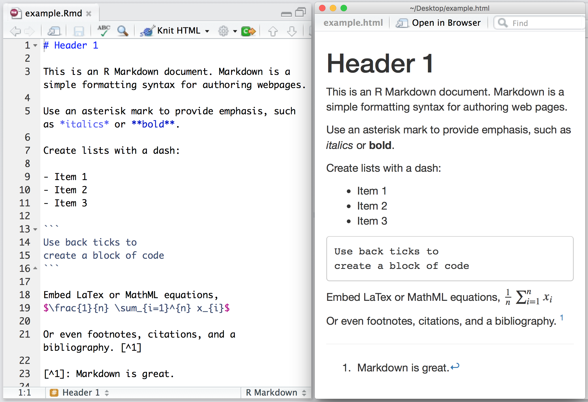
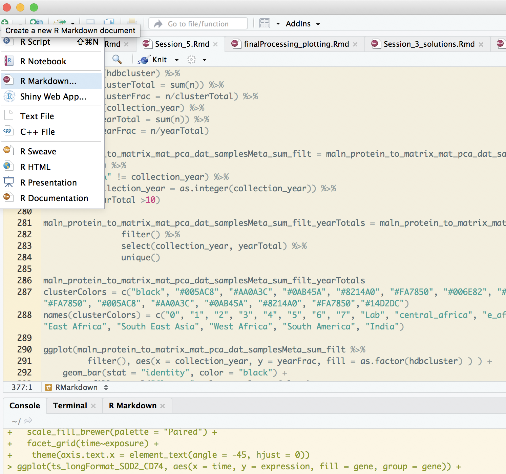
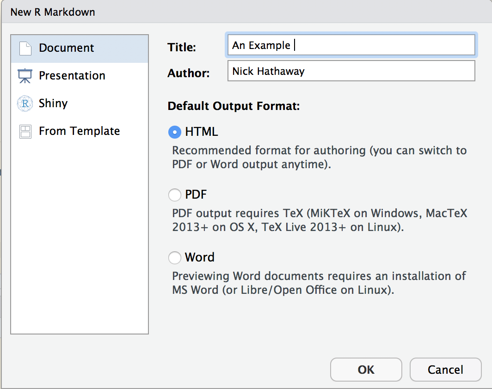
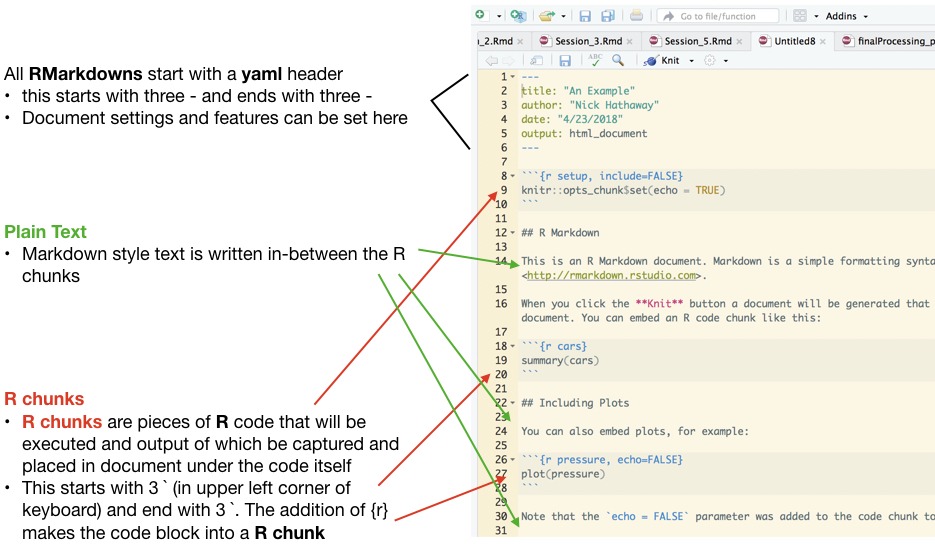
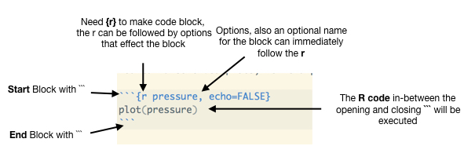

<!--Include script for hiding output chunks-->
<script>
$(document).ready(function() {
	console.log("hello")
  // Select all <pre> tags that do not have class 'r'
  $output = $(".toggleOutput");
  console.log($output)
  // Add the show/hide-button to each output chunk
  $output.prepend("<button style=\"float:right\" class=\"btn btn-primary showopt\">Show Output</button><br/>");
  // Select the <pre> tags, then choose their <code> child tags and toggle visibility 
  $output.children("code").css({display: "none"});
  
  // When the show/hide-button is clicked, toggle the current state and
  // change the button text
  $(".showopt").click(function() {
    $btn = $(this);
    $chunk = $(this).parent().children("code");
    if($btn.html() === "Show Output") {
      $btn.html("Hide Output");
    } else {
      $btn.html("Show Output");
    }
    $btn.toggleClass("btn-info btn-primary");
    $chunk.slideToggle("fast", "swing");
  });
});

</script>

```{r setup, echo=FALSE, message=FALSE}
require(knitr)
#turn off mesages and warnings and make it so output isn't prefixed by anything,
#default is to put "##" in front of all output for some reason
#also set tidy to true so code is wrapped properly 
opts_chunk$set(message=FALSE, warning=FALSE, comment = "")
options(width = 60)

knitr::knit_hooks$set(output = function(x, options) {
  return(paste0(
    "```{",
    ifelse(is.null(options$class),
      "", 
      paste0(" .", gsub(" ", " .", options$class))
    ),
    "}\n",
    x,
    "\n```"
  ))
})
```


# Adding Text To Plots  

## Line graph 

Reading and processing data 
```{r}
library(tidyverse)
#
ts_longFormat = read_tsv("time.series.data.txt") %>% 
  rename(gene = X1) %>% 
  gather(Condition, expression, 2:ncol(.) ) %>% 
  separate(Condition, c("exposure", "time") )  %>% 
  mutate(time = as.numeric(gsub("h", "", time) ) )

# also you can also the %in% operator that R offers 
ts_longFormat_SOD2_CD74 = ts_longFormat %>% 
  filter(gene %in% c("SOD2", "CD74") )

# create a grouping variable to make plotting easier 
ts_longFormat_SOD2_CD74 = ts_longFormat_SOD2_CD74 %>% 
  mutate(grouping = paste0(gene, "-", exposure))

```

Here is a plot from the last Session 
```{r}
# using group = grouping to separate out the different genes and the exposure but still color by exposure 
geneLinetypes =c("dotted", "solid")
names(geneLinetypes) = c("CD74", "SOD2")
# make the points larger, the value given to size is a relative number  
ggplot(ts_longFormat_SOD2_CD74, aes(x = time, y = expression, color = exposure, group = grouping)) + 
  geom_point(aes(shape = gene), size = 3) + 
  geom_line(aes(linetype = gene)) + 
  scale_color_brewer(palette = "Dark2") + 
  scale_shape_manual(values = c(1, 3)) + 
  scale_linetype_manual(values = geneLinetypes)

```

Now imagine we want to add text to each line so we can have a label for what each line represents. This could be accomplished in several ways, one way is to first create a data frame with data points for each the max time point for each grouping variable. 

```{r}

ts_longFormat_SOD2_CD74_summary = ts_longFormat_SOD2_CD74 %>% 
  filter("Ctrl" != exposure) %>% 
  group_by(grouping) %>% 
  mutate(maxTime = max(time)) %>% 
  filter(time == maxTime)
```

Once we have this data frame, we can use it to add a label at the further time point, which will be at the end of each line. This can be done by utilizing the fact that when adding geom_[LAYER] layers we can assign a new data frame for the layer to base its layout off of by doing `data=`.     
```{r}
ggplot(ts_longFormat_SOD2_CD74, aes(x = time, y = expression, color = exposure, group = grouping)) + 
  geom_point(aes(shape = gene), size = 3) + 
  geom_line(aes(linetype = gene)) + 
  scale_color_brewer(palette = "Dark2") + 
  scale_shape_manual(values = c(1, 3)) + 
  scale_linetype_manual(values = geneLinetypes) + 
  geom_text(aes(label = grouping), data = ts_longFormat_SOD2_CD74_summary)
```

Here we used the geom_text layer which adds text, it needs a x and y (which was set in the top ggplot aes) and a label variable for what it's going to add as text to the plot. Notice how the text is centered on the last point, but we can't see it very well, so to change the text alignment we use `hjust=`, 0 = start at the x,y coordinates, 0.5 (default) = center on the x,y coordinates, and 1 = end at the x,y coordinates.    
```{r}
ggplot(ts_longFormat_SOD2_CD74, aes(x = time, y = expression, color = exposure, group = grouping)) + 
  geom_point(aes(shape = gene), size = 3) + 
  geom_line(aes(linetype = gene)) + 
  scale_color_brewer(palette = "Dark2") + 
  scale_shape_manual(values = c(1, 3)) + 
  scale_linetype_manual(values = geneLinetypes) + 
  geom_text(aes(label = grouping), hjust = 0, data = ts_longFormat_SOD2_CD74_summary)

```

So now the text starts at the point but it's still over the point so lets nudge it a little bit to the right by use `nudge_x=` to nudge it over 1 x-axis unit
```{r}
ggplot(ts_longFormat_SOD2_CD74, aes(x = time, y = expression, color = exposure, group = grouping)) + 
  geom_point(aes(shape = gene), size = 3) + 
  geom_line(aes(linetype = gene)) + 
  scale_color_brewer(palette = "Dark2") + 
  scale_shape_manual(values = c(1, 3)) + 
  scale_linetype_manual(values = geneLinetypes) + 
  geom_text(aes(label = grouping), nudge_x = 1, hjust = 0, data = ts_longFormat_SOD2_CD74_summary)
```

Though unfortunately ggplot doesn't take into account the text when determining limits so we have to change them to be able to see the text  
```{r}
ggplot(ts_longFormat_SOD2_CD74, aes(x = time, y = expression, color = exposure, group = grouping)) + 
  geom_point(aes(shape = gene), size = 3) + 
  geom_line(aes(linetype = gene)) + 
  scale_color_brewer(palette = "Dark2") + 
  scale_shape_manual(values = c(1, 3)) + 
  scale_linetype_manual(values = geneLinetypes) + 
  geom_text(aes(label = grouping), nudge_x = 1, hjust = 0, data = ts_longFormat_SOD2_CD74_summary) + 
  xlim(0, 30)


```


## Bar graph

Now let's try adding text to a barplot, lets define the time points as factors so we don't have to have so much space between each bar  
```{r}
ts_longFormat_SOD2_CD74 = read_tsv("time.series.data.txt") %>% 
  rename(gene = X1) %>% 
  gather(Condition, expression, 2:ncol(.) ) %>% 
  separate(Condition, c("exposure", "time") ) %>% 
  filter(gene %in% c("SOD2", "CD74") )%>% 
  mutate(time = factor(time, levels = c("0h", "1h", "2h", "4h", "6h", "12h", "24h")))

ggplot(ts_longFormat_SOD2_CD74, aes(x = time, y = expression, fill = gene)) + 
  geom_bar(stat = "identity", position = "dodge") + 
  scale_fill_brewer(palette = "Dark2")
```

```{r}
ggplot(ts_longFormat_SOD2_CD74, aes(x = time, y = expression, fill = gene)) + 
  geom_bar(stat = "identity", position = "dodge") + 
  scale_fill_brewer(palette = "Dark2") + 
  geom_text(aes(label = expression))
```

These numbers are quite large so let's change it so they only show 3 significant figures using `signif()` function    
```{r}
ggplot(ts_longFormat_SOD2_CD74, aes(x = time, y = expression, fill = gene)) + 
  geom_bar(stat = "identity", position = "dodge") + 
  scale_fill_brewer(palette = "Dark2") + 
  geom_text(aes(label = signif(expression, 3)))
```

Also look how the numbers are over the place, what's happening? Well, we still haven't taken into account the different exposures. We could handle this in a couple of ways but let's take advantage of the `face_wrap` function in ggplot. By using the ~ symbol we tell face_wrap what columns to use to create separate panels. 
```{r}
ggplot(ts_longFormat_SOD2_CD74, aes(x = time, y = expression, fill = gene)) + 
  geom_bar(stat = "identity", position = "dodge") + 
  scale_fill_brewer(palette = "Dark2") + 
  geom_text(aes(label = signif(expression, 3))) + 
  facet_wrap(~exposure)
```

Notice how the limits for each axis is the same across all panels, we can change this by setting the `scales=` to free (different limits for each panel), free_x(different for just x), or free_y (different for just y) 
```{r}
ggplot(ts_longFormat_SOD2_CD74, aes(x = time, y = expression, fill = gene)) + 
  geom_bar(stat = "identity", position = "dodge") + 
  scale_fill_brewer(palette = "Dark2") + 
  geom_text(aes(label = signif(expression, 3)), position = "dodge") + 
  facet_wrap(~exposure, scales = "free_x")

```

Because the barplot is dodged, we have to doge the geom_text as well, each that is done with the position_dodge function rather than just `"dodge"`.  
```{r}
ggplot(ts_longFormat_SOD2_CD74, aes(x = time, y = expression, fill = gene, group = gene)) + 
  geom_bar(stat = "identity", position = "dodge") + 
  scale_fill_brewer(palette = "Dark2") + 
  geom_text(aes(label = signif(expression, 3)), position = position_dodge(width = 0.9) ) + 
  facet_wrap(~exposure, scales = "free_x")

```

Also let's raise the labels a bit above the bars by adding 1000 to the y 
```{r}
ggplot(ts_longFormat_SOD2_CD74, aes(x = time, y = expression, fill = gene)) + 
  geom_bar(stat = "identity", position = "dodge") + 
  scale_fill_brewer(palette = "Dark2") + 
  geom_text(aes(y = expression + 1000,  label = signif(expression, 3)), position = position_dodge(width = 0.9) ) + 
  facet_wrap(~exposure, scales = "free_x")
```

Also let's angle the text by setting `angle = 45` to put the text at a slant to fit a bit better 
```{r}
ggplot(ts_longFormat_SOD2_CD74, aes(x = time, y = expression, fill = gene)) + 
  geom_bar(stat = "identity", position = "dodge") + 
  scale_fill_brewer(palette = "Dark2") + 
  geom_text(aes(y = expression + 1000,  label = signif(expression, 3)), angle = 45, position = position_dodge(width = 0.9) ) + 
  facet_wrap(~exposure, scales = "free_x")
```

We can also give a bit more room with putting the label on the bottom.  
```{r}
ggplot(ts_longFormat_SOD2_CD74, aes(x = time, y = expression, fill = gene)) + 
  geom_bar(stat = "identity", position = "dodge") + 
  scale_fill_brewer(palette = "Dark2") + 
  geom_text(aes(y = expression + 1000,  label = signif(expression, 3)), angle = 45, position = position_dodge(width = 0.9) ) + 
  facet_wrap(~exposure, scales = "free_x") + 
  theme(legend.position = "bottom")

```


### Another Example  
Here is an example of adding text to a bar graph to indicate how big each group is when plotting relative proportions 

```{r}
maln_protein_to_matrix_mat_pca_dat_samplesMeta = readr::read_tsv("maln_protein_to_matrix_mat_pca_dat_samplesMeta.tab.txt")
maln_protein_to_matrix_mat_pca_dat_samplesMeta

maln_protein_to_matrix_mat_pca_dat_samplesMeta_sum = maln_protein_to_matrix_mat_pca_dat_samplesMeta %>% 
    group_by(hdbcluster, collection_year) %>% 
    summarise(n = n()) %>% 
    group_by(hdbcluster) %>% 
    mutate(clusterTotal = sum(n)) %>% 
    mutate(clusterFrac = n/clusterTotal) %>% 
    group_by(collection_year) %>% 
    mutate(yearTotal = sum(n)) %>% 
    mutate(yearFrac = n/yearTotal)
  
maln_protein_to_matrix_mat_pca_dat_samplesMeta_sum_filt = maln_protein_to_matrix_mat_pca_dat_samplesMeta_sum %>% 
   group_by() %>% 
   filter("NA" != collection_year) %>% 
   mutate(collection_year = as.integer(collection_year)) %>% 
   filter(yearTotal >10)

maln_protein_to_matrix_mat_pca_dat_samplesMeta_sum_filt_yearTotals = maln_protein_to_matrix_mat_pca_dat_samplesMeta_sum_filt %>% 
                filter() %>% 
                select(collection_year, yearTotal) %>% 
                unique()

maln_protein_to_matrix_mat_pca_dat_samplesMeta_sum_filt_yearTotals
clusterColors = c("black", "#005AC8", "#AA0A3C", "#0AB45A", "#8214A0", "#FA7850", "#006E82", "#FA78FA", "black", "#005AC8", "#AA0A3C", "#0AB45A", "#8214A0", "#FA7850", "#005AC8", "#AA0A3C", "#0AB45A", "#8214A0", "#FA7850","#14D2DC")
names(clusterColors) = c("0", "1", "2", "3", "4", "5", "6", "7", "Lab", "central_africa", "e_africa", "se_asia", "w_africa", "south_america","Central Africa", "East Africa", "South East Asia", "West Africa", "South America", "India")

ggplot(maln_protein_to_matrix_mat_pca_dat_samplesMeta_sum_filt %>% 
         filter(), aes(x = collection_year, y = yearFrac, fill = as.factor(hdbcluster) ) ) + 
    geom_bar(stat = "identity", color = "black") + 
    scale_fill_manual("Cluster",values = clusterColors) +
    scale_x_continuous(breaks = seq(min(maln_protein_to_matrix_mat_pca_dat_samplesMeta_sum_filt$collection_year), max(maln_protein_to_matrix_mat_pca_dat_samplesMeta_sum_filt$collection_year))) +
    theme_bw() + ggtitle("") + 
    theme(axis.text.x = element_text(family = "Helvetica",face="plain", colour="#000000", angle = 90, hjust = 1),
          axis.title = element_text(family = "Helvetica", face="bold",  colour="#000000"),
          plot.title = element_text(family = "Helvetica", face="bold",  colour="#000000", hjust = 0.5), 
          panel.border = element_blank(),            
          panel.grid.major.x = element_blank(),            
          axis.ticks.x = element_blank()) +
    geom_text(data = maln_protein_to_matrix_mat_pca_dat_samplesMeta_sum_filt_yearTotals, 
              aes(x = collection_year, y = 1.07, label = paste0("n=", yearTotal), angle = 45) ,
              inherit.aes = F) + 
  labs(x = "Collection Year", y = "Relative Proportions")

```

# Dividing Data into Quantiles  
Some times it might be helpful to split data into different bins by creating evenly sized quantiles. This can be done by using the `ntile()` function. Here we are creating quantiles based off of the sd of the Lps exposure, to bin genes by how variable their expression is during the Lps time points.     
```{r}

ts_longFormat_lps_sum = ts_longFormat %>% 
  filter(exposure == "Lps") %>% 
  group_by(gene) %>% 
  summarise(lps_sd = sd(expression))
ts_longFormat_lps_sum


ntiles = 2000
ts_longFormat_lps_sum = ts_longFormat_lps_sum %>% 
  mutate(lps_sd_quantile = ntile(lps_sd, ntiles))

```

We can add this quantile information back to the original data set by using the `left_join()` function, which takes a data frame and takes another data frame with which it shares columns, by matching information in the shared columns left_join adds what ever columns the first data frame doesn't have and populates these columns by matching up the data in the shared columns.  
```{r}

ts_longFormat = ts_longFormat %>% 
  left_join(ts_longFormat_lps_sum)
ts_longFormat

```

Let's take the 2000th quantile 
```{r}
top_ts_longFormat = ts_longFormat %>% 
  filter(lps_sd_quantile == 2000)

bottom_ts_longFormat = ts_longFormat %>% 
  filter(lps_sd_quantile == 1)

```

And plot all the genes by using facet_wrap to seperate out the genes and allow their y axis to be different between panels.  
```{r}
ggplot(top_ts_longFormat, aes(x = time, y = expression, color = exposure)) + 
  geom_point() + 
  geom_line() + 
  scale_color_brewer(palette = "Dark2") + 
  facet_wrap(~gene, scales = "free_y")


```

The facet_wrap function also allows you set how many columns to have by using the `ncol=` arguments.  
```{r}
ggplot(top_ts_longFormat, aes(x = time, y = expression, color = exposure)) + 
  geom_point() + 
  geom_line() + 
  scale_color_brewer(palette = "Dark2") + 
  facet_wrap(~gene, scales = "free_y", ncol = 3)

```

facet_grid is another faceting function that sets out things in a grid pattern which is better for showing relationships, the face_wrap just create a panel for each level and puts these panels in the order that the levels go but facet_grid will layout the panels in a grid.   
```{r}
ggplot(top_ts_longFormat, aes(x = gene, y = expression, fill = gene)) + 
  geom_bar(stat = "identity", color = "black") + 
  scale_fill_brewer(palette = "Paired") + 
  facet_grid(time~exposure) +
   theme(axis.text.x = element_text(angle = -45, hjust = 0))

```

Also the library [cowplot](https://cran.r-project.org/web/packages/cowplot/vignettes/introduction.html) is a great library for setting up completely different plots in custum sized panels like in a figure.  

# Part 1 Excerices 
Using the Temperature data frame from last sessions  
<a download = "avg_temps_usa_wide.tab.txt" href = "avg_temps_usa_wide.tab.txt">Average Temperatures USA</a>  

1.  Create a bar plot of temperatures for 1995 for Boston and put the temperatures on top of the bars, x-axis = month, y-axis = temperature  
2.  Create a line graph for all years in Boston and put the name of the year next to the line after December , x-axis = month, y-axis = temperature  
3.  Create a bar plot for all years in Boston but facet the plot so each year has its own panel , x-axis = month, y-axis = temperature  
4.  Create quantiles with 100 bins for mean temperatures over all years for each Station, and take the 100th bin and create a bar graph, with x-axis Station_Name, y-axis temperate, and using face_grid plot month by year   


# RMarkdown  
[Markdown](https://en.wikipedia.org/wiki/Markdown) is the term for a way of writing plain text files with certain syntax that when given to a program will render the contents into a rich document, like an HTML document. Many different flavors of Markdown exist but most follow similar rules. RMarkdown is a flavor of markdown that allows for inserting R Code into the document that will then run and the output of the code will be captured and placed into the final document. This is a great way to create an information document for your R code, creating R examples, and because the final output is an HTML document they can include interactive graphs and tables that R helps to create. In fact all Session pages so far have been created by using RMarkdown, for example here is the document that created this page itself [Session 6](Session_5.Rmd).  

There are many features offered by RMarkdown, here are a few cheatsheets that RStudio offers that help and are great references guides, https://www.rstudio.com/wp-content/uploads/2015/02/rmarkdown-cheatsheet.pdf and https://www.rstudio.com/wp-content/uploads/2015/03/rmarkdown-reference.pdf. 

Below is an example of how text looks like rendering and how syntax controls the output



Within RStudio you can create a new RMarkdown by click the + symbol in the top left corner. And you normally just pick HTML for output. When you do this, RStudio will ask to install the libraries needed to create RMarkdowns.   





Below is the default RMarkdown document created when creating a new Document 



## R Code Chunks  
Below is an example of a R code chunk 



Important nodes of about r chunks 

*  The whole document is ran in a brand new R Session and therefore libraries need to be loaded at the beginning of the document  
*  Each r code is ran in the same R Session, meaning all the R code is ran as if it you took all the R code and pasted into one R script and ran it  
*  When naming chunks, the name must always be unique (the name above for this chunk is pressure and cannot be used again)  
*  Options given to the chunk are separated by commas 
*  The working directory of the R code executed is the directory where the RMarkdown document is located 
*  The resulting output document is in the same directory as the RMarkdown document. 

Some important and commonly used options to 

*  **echo** - This will control if the R code itself is shown in the output document (by default it is)  
*  **eval** - This will control if the R code is executed, if this is set to FALSE the code will be shown but not executed (this might be good for when trying to show R examples but don't want the code to execute)  
*  **fig.width** - This will affect the width of the captured output of the code chunk, important for plots   
*  **fig.height** - This will affect the height of the captured output of the code chunk, important for plots   

And there are many more options, see the reference/cheatsheets for examples.

Once you want to create the output document, you hit the knit button. 


Part 2. Exercises 

1.  Create a directory and put the temperature dataset in it and create a new RMarkdown and save it in the same directory. 
2.  Take the code from Part 1 and put it in the RMarkdown to create a HTMl page of the plots you created, add a Header for each plot (by using the \# symbol).  
3.  By looking at the cheatsheets, try to figure out how to add a table of contents to document.  


```{r, echo =F, eval = F}

temps = readr::read_tsv("../Session_3/avg_temps_usa_wide.tab.txt")

# there appears to be an outlier with 
temps = temps %>% 
  filter(Longitude < 0)

temps_mat = as.matrix(temps[,6:ncol(temps)])
rownames(temps_mat) = temps$Station_Name
temps_mat[is.na(temps_mat)] = mean(temps_mat,na.rm = T)
temps_mat_pca = prcomp(temps_mat)
df = as_data_frame(temps_mat_pca$x)
df$Station_Name = rownames(temps_mat_pca$x)

df = df %>% 
  left_join(temps %>%
              select(Station_Name, Latitude, Longitude, `State_/_Province_Code`))

ggplot(df, aes(x = PC1, y = PC2)) + geom_point(aes(color = Latitude))
ggplot(df, aes(x = PC1, y = PC2)) + geom_point(aes(color = Longitude))
ggplot(df, aes(x = PC1, y = PC2)) + geom_point(aes(color = sqrt(Longitude^2 +  Latitude^2) ))
ggplot(df, aes(x = PC1, y = PC2)) + geom_point(aes(color = `State_/_Province_Code`))

time = readr::read_tsv("../Session_1/time.series.data.txt")
time_mat = time[, 2:ncol(time)]
rownames(time_mat) = time$X1
time_mat_pca = prcomp(time_mat)
df = as_data_frame(time_mat_pca$x)
df$gene = rownames(time_mat_pca$x)
ggplot(df, aes(x = PC1, y = PC2)) + geom_point( )

df %>% 
  filter(PC1 > 10000, PC2 > 20000) %>% 
  select(gene)

time_mat = as.matrix(time[, 2:ncol(time)])
rownames(time_mat) = time$X1
time_mat = time_mat["FTL" != rownames(time_mat), ]

time_mat_pca = prcomp(time_mat)
df = as_data_frame(time_mat_pca$x)
df$gene = rownames(time_mat_pca$x)
ggplot(df, aes(x = PC1, y = PC2)) + geom_point( )


```
