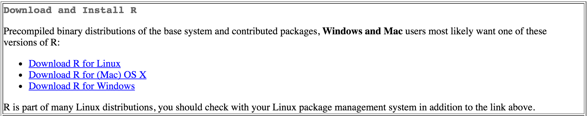
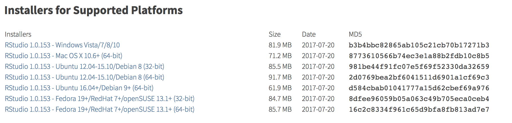
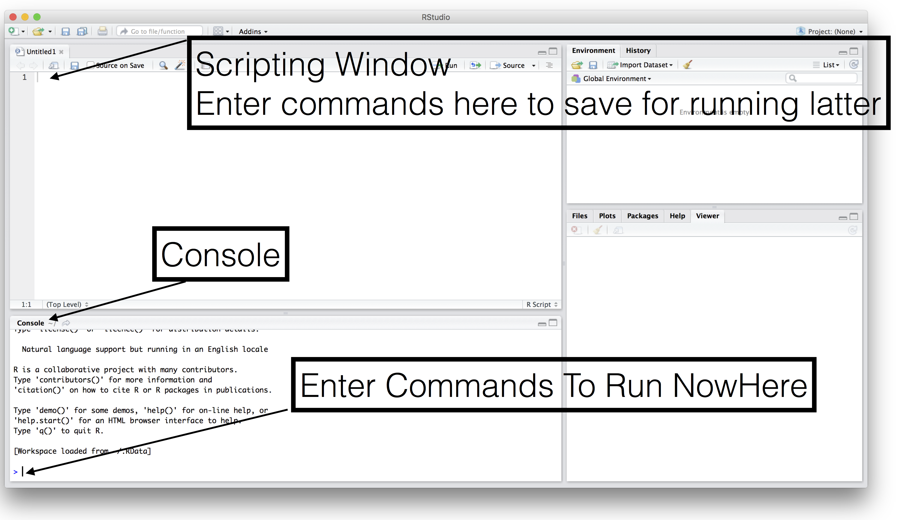

```{r setup, echo=FALSE, message=FALSE}
require(knitr)
require(DT)
require(tidyverse)
require(stringr)
require(plotly)
require(rwantshue)
#turn off mesages and warnings and make it so output isn't prefixed by anything,
#default is to put "##" in front of all output for some reason
#also set tidy to true so code is wrapped properly 
opts_chunk$set(message=FALSE, warning=FALSE, comment = "")
options(width = 200)

newPath = Sys.getenv("PATH")
newPath = paste("/usr/local/bin:/Users/nick/Documents/malaria-gen-analysis/utils:/home/hathawan/hathaway/bin:", newPath,sep = "")
Sys.setenv(PATH=newPath)
```

# Installing R and RStudio

R is the underlying program that is a collection of tools and packages to analyze data. RStudio is a program that makes interacting with R and writing code for R a lot easier.  

1. Download and install R: http://cran.r-project.org  
Choose the installer for your operating system.  
  
2. Download and install RStudio: http://www.rstudio.com/products/rstudio/download/  
Scroll down the page until you see Installers for Supported Platforms  

  
3. Open RStudio (you might only see 3 windows instead of 4)   
   

To see the scripting window, which scripting will be gone over in class, you need to add the little plus sign to open a new file and choose R Script. Then you can write code to save for latter and reuse, again this will be gone over in class.  

# Small tutorial on basics of R
Next you should complete this short introduction of the very basics of R.  It should only take about 15-20 minutes to complete but is a very helpful introduction to R. Site here, [tryr.codeschool](http://tryr.codeschool.com/)

# Installing R Packages
Once you are comfortable with entering commands into R, enter the following commands into the console window to install the R packages that are in common use. The reason we have to do this is that when you install R you only get the core default packages but there are a lot more packages out there for R that add a lot more functionality to R.

The command used to install new packages is called `install.package()`. The package to install is called [tidyverse](https://www.tidyverse.org/). This is collection of packages that is gaining in popularity lately. See more details on the different packages included in `tidyverse` here, https://www.tidyverse.org/packages/. 

# Installing Tidyverse  
Type the following command into the console window to install `tidyverse`.  

```{r, eval = F}
install.packages(c("tidyverse"))
```


