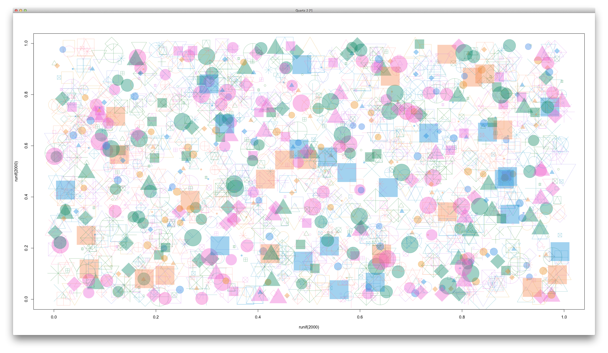
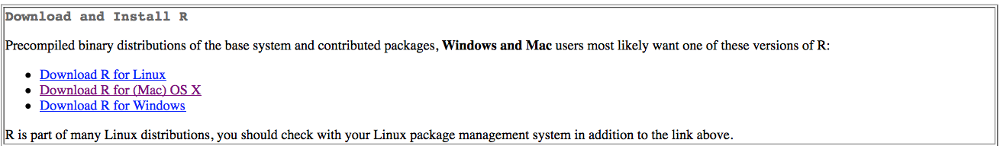
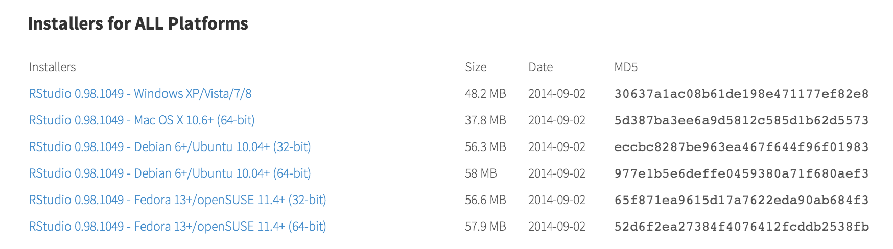
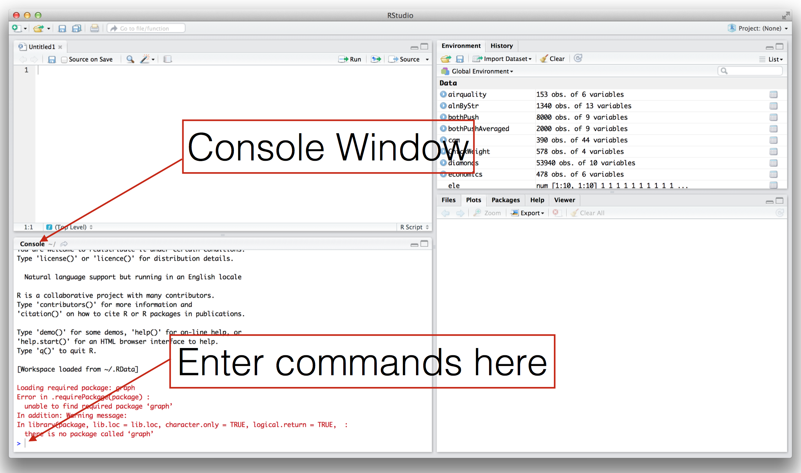
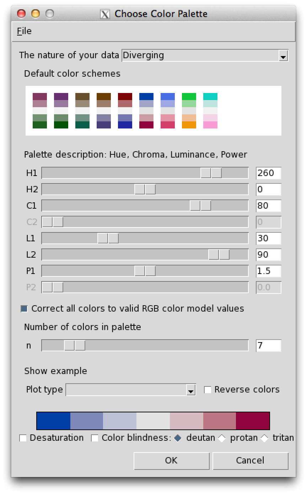

```{r setup, echo=FALSE, message=FALSE}
require(knitr)
#turn off mesages and warnings and make it so output isn't prefixed by anything, default is to put "##" in front of all output for some reason
opts_chunk$set(message=FALSE, warning=FALSE, comment = "")
```

**Confidence Builder #1: Random Shapes**

**Objective:** Create an image composed of random shapes and colors like the one below.  

  
1. Download and install R: http://cran.r-project.org  
  
2. Download and install RStudio: http://www.rstudio.com/products/rstudio/download/  
  
3. Open RStudio (you might only see 3 windows instead of 4)   
   
4. In the console window enter this command to install an R package useful for choosing color palattes: Enter the bellow command or copy and paste it into the **console** window:  
``` {r, eval=FALSE}
install.packages("colorspace")
```  
5. Now, load the colorspace package into your current R session. Enter the bellow command or copy and paste it into the **console** window:  
``` {r}
library(colorspace)
```  
6. Create a color palette called pal:  Enter the bellow command or copy and paste it into the **console** window:  
``` {r, eval=FALSE}
pal <- choose_palette()
```  
Select a color scheme and move the sliders to change the hue of your palette, then press **ok**. The palette is displayed as a color bar at the bottom of the **Choose Color Palette** window.


7. Create a random image using your palette: Enter the bellow command or copy and paste it into the **console** window:
```{r setPal, echo=FALSE, message=FALSE}
pal<-function (n, h = c(-240, 60), c. = c(80, 100), l = c(40, 70), 
    power = c(1.75384615384615, 1.3), fixup = TRUE, gamma = NULL, 
    alpha = 1, ...) 
{
    if (!is.null(gamma)) 
        warning("'gamma' is deprecated and has no effect")
    if (n < 1L) 
        return(character(0L))
    h <- rep(h, length.out = 2L)
    c <- rep(c., length.out = 2L)
    l <- rep(l, length.out = 2L)
    power <- rep(power, length.out = 2L)
    rval <- seq(1, 0, length = n)
    rval <- hex(polarLUV(L = l[2L] - diff(l) * rval^power[2L], 
        C = c[2L] - diff(c) * rval^power[1L], H = h[2L] - diff(h) * 
            rval), fixup = fixup, ...)
    if (!missing(alpha)) {
        alpha <- pmax(pmin(alpha, 1), 0)
        alpha <- format(as.hexmode(round(alpha * 255 + 1e-04)), 
            width = 2L, upper.case = TRUE)
        rval <- paste(rval, alpha, sep = "")
    }
    return(rval)
}
```

```{r, fig.height=10, fig.width=10, fig.cap='Random Shapes'}
plot(runif(2000),runif(2000),col=pal(100, alpha=.4),cex=seq(1:10),pch=seq(1:25))
```

9. Learn a little more about programming in R with this pirate-themed tutorial: http://tryr.codeschool.com

